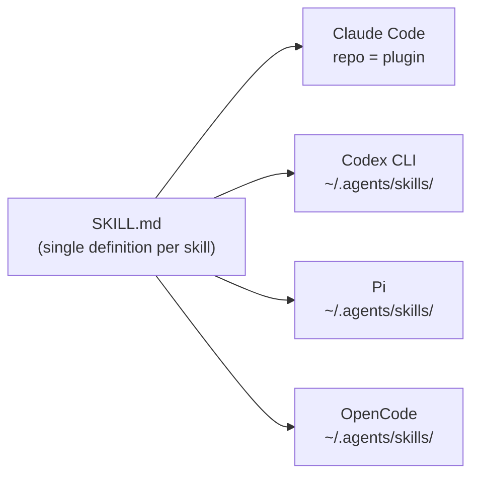

# Architecture

super-spec is a spec-driven development toolkit for AI coding agents. It packages
engineering workflows — spec authoring, planning, multi-agent coding, multi-agent
review, PR delivery, troubleshooting — as a single set of [Agent Skills](https://agentskills.io)
that runs unmodified on Claude Code, OpenAI Codex, Pi, and OpenCode.

This document explains the reasoning behind that design and how the pieces fit
together. For the rules that keep AI-generated code safe and correct, see
[guardrails.md](./guardrails.md).

## Why This Exists

Modern AI coding agents are capable enough to write features end to end, open pull
requests, and review each other's work. Left to its own judgment, though, an agent
defaults to whatever is average in its training data — not what your team actually
does. Four problems show up repeatedly once AI is doing real engineering work
instead of autocomplete:

| Problem | What happens without a toolkit | How super-spec addresses it |
|---|---|---|
| Inconsistent process | Every session runs the task differently; output quality swings from run to run | Each task type gets a skill that encodes one fixed procedure |
| Standards never reach the agent | Security, testing, and review rules live in documents humans skim once and forget | Guardrails ship as files a skill reads automatically, not prose a human has to remember |
| Multi-step tasks lose their thread | Spec → plan → code → review has several steps; agents skip or reorder them | Workflow skills chain the steps explicitly and gate on completion before moving on |
| Institutional knowledge doesn't compound | A good practice one engineer discovers stays in their head | Practices are captured once as a skill and reused by every agent, on every project |

The underlying stance is **AI does the driving, humans supervise the gates**. Rather
than a human re-reading every line of every diff, the toolkit builds the checks —
test-first development, multi-agent review, verification before completion — into
the workflow itself, so a human's attention goes to the gate outcomes, not the
mechanics of getting there.

That's also why this is called a toolkit and not a training set: skills don't make
an agent better at writing code technically. They make it follow the same
disciplined procedure every time, regardless of which model is behind the wheel.

## One Skill Definition, Four Runtimes

The entire toolkit is expressed once, as `SKILL.md` files following the
[agentskills.io](https://agentskills.io) standard: a short YAML frontmatter with
just a `name` and a `description`, followed by a plain-language body describing
purpose, inputs, steps, outputs, and failure handling. There is no
Claude-Code-flavored version and a separate Codex-flavored version — one file
serves every supported tool because of where each tool looks for skills:

- **Claude Code** treats the whole repository as a plugin. `.claude-plugin/marketplace.json`
  and `.claude-plugin/plugin.json` register it, and Claude Code auto-discovers every
  `skills/*/SKILL.md` inside — there's no separate command manifest to keep in sync
  with the skill files themselves.
- **Codex CLI, Pi, and OpenCode** all look for skills at `~/.agents/skills/<name>/SKILL.md`,
  the shared agentskills.io filesystem convention. Installing the toolkit for these
  tools means copying or symlinking each `skills/ss-*` directory into that path —
  same file, same content, no rewrite.



A handful of authoring rules make this portability possible rather than aspirational:

- Frontmatter carries only `name` and `description` — no `allowed-tools`, `context`,
  `argument-hint`, or other platform-private fields that only one tool understands.
- No `$ARGUMENTS`/`$1` placeholders. A skill that needs user input says so in an
  "## Inputs" section and asks for what's missing, since not every runtime supports
  positional command arguments the same way.
- Cross-skill calls read as plain mentions — "run the `ss-create-branch` skill" —
  instead of a platform-specific slash command.
- Tool use is described generically ("use your file-search tool," "spawn a
  subagent for the security review") rather than naming a tool that only exists in
  one runtime.

## Repository Layout

```
super-spec/
├── .claude-plugin/
│   ├── marketplace.json         # registers this repo as a Claude Code plugin source
│   └── plugin.json              # plugin manifest (name, description, version)
├── skills/
│   ├── ss-<name>/
│   │   └── SKILL.md             # one skill = one directory = one SKILL.md
│   ├── ss-guardrails/
│   │   ├── SKILL.md
│   │   ├── core.md              # cross-language safety/quality rules
│   │   ├── java.md
│   │   ├── go.md
│   │   ├── cpp.md
│   │   ├── web.md
│   │   ├── android.md
│   │   ├── ios.md
│   │   └── flutter.md
│   └── _references/
│       └── <shared-prompt-template>.md   # prompt templates reused by multi-agent skills
└── docs/
    ├── architecture.md            # this document
    ├── guardrails.md              # why guardrails cover only safety/quality/anti-error
    ├── workflows.md               # end-to-end workflows, full/lite modes, gates, resumability
    ├── multi-agent.md             # multi-agent TDD coding and parallel review design
    ├── spec-driven.md             # living specs: delta -> archive -> trace
    └── worktree-and-multi-repo.md # parallel-work isolation and multi-repo orchestration
```

`skills/` is the single source of truth for behavior; nothing here is generated
from, or duplicated into, a platform-specific format. `skills/ss-guardrails/` and
`skills/_references/` are not standalone workflows — they're shared material that
other skills pull in at prompt time via relative paths (`../ss-guardrails/core.md`,
`../_references/proposal-template.md`). `docs/` is design documentation for
humans; it has no runtime role.

## Skill Catalog

Every migrated skill carries the `ss-` prefix and lives in its own directory. They
group into six categories:

| Category | Skills | What they do |
|---|---|---|
| **Spec** | `ss-write-spec`, `ss-show-spec`, `ss-list-changes`, `ss-trace-spec`, `ss-archive`, `ss-reverse-spec` | Maintain living specs as an [OpenSpec](https://github.com/Fission-AI/OpenSpec)-style delta workflow: draft a change, inspect current capability specs and their history, fold an approved change back into the baseline, or derive a baseline from existing (brownfield) code |
| **Workflow** | `ss-build-plan`, `ss-coding-workflow`, `ss-feature-workflow`, `ss-troubleshooting-workflow`, `ss-multi-repo-workflow` | Turn a requirement into an executable task plan and orchestrate the end-to-end paths — feature delivery, bug fix, plain coding change, or a multi-repository rollout — through branch, code, review, and PR |
| **Multi-agent** | `ss-coding`, `ss-code-review` | Fan work out across parallel subagents: test-driven implementation split by independent task, and code review split by concern (security, standards, error handling, performance, test coverage) |
| **Proposal** | `ss-proposal` | Turn a requirement into a structured, high-level technical proposal — architecture, interfaces, trade-offs — before anyone writes code |
| **Git** | `ss-create-branch`, `ss-create-pr`, `ss-cleanup` | Handle the git mechanics: cut a branch (with an optional isolated worktree), open a pull request once quality gates pass, and tear down the branch/worktree afterward |
| **Diagnostics** | `ss-inspect` | Root-cause a live issue through a staged, evidence-driven process |

`ss-guardrails` sits outside this table on purpose — it isn't something you invoke
as a task, it's the shared rulebook the other skills read from. See the next
section and [guardrails.md](./guardrails.md) for the full rationale.

Not everything in the source material made the cut. Vendor-specific integrations
(a proprietary chat-tool auth flow, a proprietary telemetry/reporting backend) and
one-time repository bootstrapping that depended on a company's internal submodule
registry were left out of the open-source scope — the toolkit favors a smaller,
portable surface over parity with every internal integration.

## Guardrails, in Brief

Guardrails are a shared rulebook, not a per-project file. They consist of one
cross-language file (`core.md`) plus one file per supported stack (Java, Go, C++,
Web, Android, iOS, Flutter). Skills that generate or review code read `core.md`
and, when the target project's language is known, the matching per-language file —
via a plain relative path, at the moment they need it. Nothing from
`ss-guardrails` is ever copied into the project you're working on. The full
reasoning — why guardrails stop at safety/quality/error-prevention and
deliberately leave style and tooling choices alone — is in
[guardrails.md](./guardrails.md).

## Delivery Modes: Full and Lite

Skills that touch git history (`ss-create-branch`, `ss-create-pr`, `ss-cleanup`)
and the workflow orchestrators built on top of them (`ss-coding-workflow`,
`ss-feature-workflow`, `ss-troubleshooting-workflow`, `ss-multi-repo-workflow`)
support two delivery modes:

- **`full`** (default) — cut a branch (optionally in an isolated worktree), do the
  work, open a pull request, then clean up the branch and worktree.
- **`lite`** — skip branch and PR entirely; work on the current branch and finish
  with a [Conventional Commits](https://www.conventionalcommits.org/)-formatted
  commit (pushing is optional), then report a summary of the change.

The mode comes from an explicit user choice, or a single question asked once when
a workflow starts — it is never inferred silently, and no mode preference is
written into the user's project. Quality gates (test-driven development,
multi-agent review, verification before completion) are identical in both modes;
`lite` changes how the change is delivered, not how carefully it's built.
`ss-create-pr` itself adapts to whichever forge is in use — GitHub via `gh`,
GitLab via `glab` — detected from the repository's remote, and falls back to a
local commit plus a written summary if no remote, no CLI, or no user confirmation
is available, which is treated as a normal outcome rather than a failure.

## Where to Go Next

- [guardrails.md](./guardrails.md) — why guardrails are scoped the way they are,
  and how to extend them.
- `skills/ss-<name>/SKILL.md` — the exact steps, inputs, and outputs for any
  individual skill.
- `skills/ss-guardrails/SKILL.md` — how to invoke the guardrails check directly,
  independent of any other skill.
