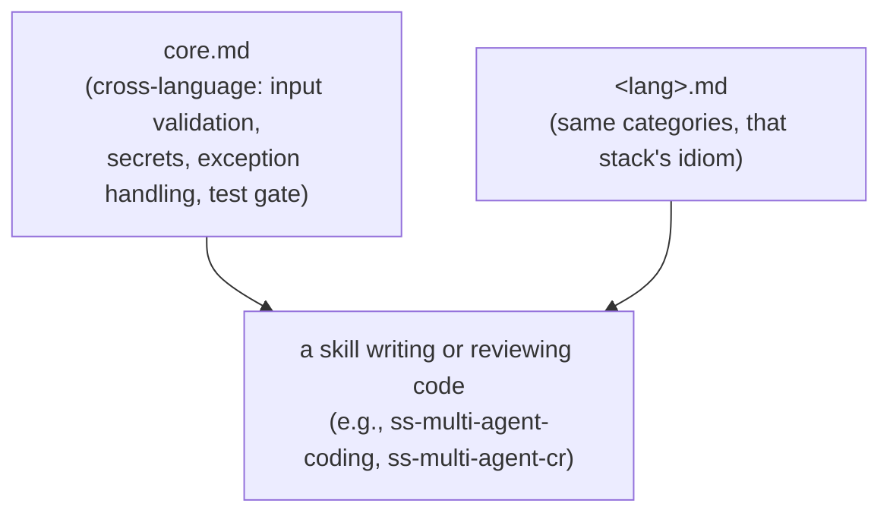

# Guardrails

Guardrails are the part of super-spec that says no. Every other skill in the
toolkit is about getting work done — draft a spec, cut a branch, implement a
plan, open a pull request. Guardrails exist to stop an agent from doing damage
while it does that work. This document explains why they're scoped as narrowly
as they are, how they're structured, how skills read them, and how to extend
them for your own stack.

## The Design Stance

Every engineering team accumulates two very different kinds of convention:

1. **Taste and tooling choices** — how you name things, which state-management
   library you picked, whether you use CSS Modules or Tailwind, how deep your
   component tree nests. These are contextual, reversible, and legitimately
   different from team to team. There is no universally correct answer, and a
   shared toolkit that tried to impose one would just be fighting whatever
   codebase it's plugged into.
2. **Failure-prevention rules** — validate every external input, never swallow
   an exception silently, don't hardcode a credential, don't ship new logic
   without a test, don't write sensitive data to a log. These are close to
   universal. Getting one of these wrong doesn't start a style debate — it
   ships an incident.

super-spec's guardrails cover only the second category. If a rule is really
about taste — naming, framework choice, folder layout, which testing library
you prefer — it isn't a guardrail, and it isn't in this toolkit at all. That
territory belongs to the project itself: its existing code, its own
`CLAUDE.md`/`AGENTS.md`, its linters. Every skill in this toolkit is already
expected to match the style of the code it's editing; guardrails don't
re-litigate that. They add exactly one more layer underneath it: a floor of
"don't do the genuinely dangerous or genuinely broken thing," which applies no
matter what style the rest of the codebase has settled on.

Put differently: a project's own instructions can add rules on top of
guardrails — stricter test coverage, an internal library requirement, a house
naming scheme — but they don't get to opt out of the guardrail floor itself.
Style is negotiable. Silently swallowing an exception or logging a password is
not.

A quick way to tell which bucket a candidate rule falls into: ask what breaks
if an agent ignores it. "Ignored our convention of using `is`/`has` prefixes
for booleans" produces a review comment. "Ignored our convention of validating
request bodies before they reach the database" produces an incident. Rules in
the first sentence stay out of guardrails no matter how strongly a team feels
about them; rules that read like the second sentence are exactly what
guardrails are for, independent of which language or framework surrounds
them.

## Structure: Core + Per-Language

Guardrails live in `skills/ss-guardrails/`:

```
skills/ss-guardrails/
├── SKILL.md      # what this skill is, when to invoke it directly
├── core.md       # cross-language rules: every stack reads this
├── java.md
├── go.md
├── cpp.md
├── web.md
├── android.md
├── ios.md
└── flutter.md
```

`core.md` holds the rules that don't depend on which language you're writing:
validate untrusted input, never leave an empty exception handler, don't commit
secrets, don't skip tests for new logic, don't leak sensitive data through
logs or error messages. Every per-language file instantiates the same handful
of categories in that language's idiom — the category doesn't change from
stack to stack, only the concrete mechanics do. A guardrail check on a Go
service, for example, reads as "always check and wrap `err`, never discard it
silently" where the Java equivalent reads as "never leave a `catch` block
empty, and don't catch exceptions you can't actually recover from." Same
category — unhandled failure — different syntax.



A skill doing or reviewing work in a known stack reads both files: `core.md`
unconditionally, and the matching `<lang>.md` once the project's language is
known. What is deliberately absent from every per-language file is anything
that reads as naming, documentation-comment conventions, or UI/architecture
layering — those stayed out of guardrails on the same design stance above,
even where the language in question has strong opinions about them.

## Consulted at Runtime, Never Installed

Skills reference guardrails through plain sibling relative paths:
`../ss-guardrails/core.md`, and `../ss-guardrails/<lang>.md` when the target
project's language is known. This resolves the same way regardless of which
runtime is asking, because `ss-guardrails` sits as a sibling directory to
every other skill in both places a skill can run from — the repository
checkout that Claude Code loads as a plugin, and the `~/.agents/skills/`
copy that Codex CLI, Pi, and OpenCode read from (see
[architecture.md](./architecture.md) for how one `SKILL.md` serves all four
runtimes).

Guardrails are read at the moment a skill needs them; they are never written
into the project being worked on. That's a deliberate constraint, not an
oversight, for three reasons:

- **No sync burden.** A file copied into every downstream project immediately
  raises the question of whether that copy is current. Reading guardrails
  from the toolkit itself means there's never a stale copy to notice, let
  alone update.
- **No intrusion.** super-spec's skills, guardrails included, don't write
  vendor files into someone else's repository. What skills do create are the
  user's own work products — the `openspec/` directory the spec skills manage,
  the proposals and plans a user asks for, an `APPLICATION.md` environment
  map — and anything that touches a project-owned file such as `AGENTS.md`
  happens only with the user's explicit consent (see
  [architecture.md](./architecture.md#skill-catalog)).
- **One upgrade point.** Update `core.md` or a per-language file once, and
  every skill invocation after that reads the new rules immediately. There's
  no per-project regeneration step, no re-injection, and no fleet of
  repositories to walk.

## Extending Your Own Checklist

To add coverage for a stack the toolkit doesn't ship (Python, Rust, whatever
you use), fork the repository and add `skills/ss-guardrails/<lang>.md`
following the same shape as the existing per-language files: input
validation, error handling, secrets and sensitive-data handling, and the test
gate for that stack — not naming conventions or architecture preferences,
which stay out by design. Update the `ss-guardrails` `SKILL.md` description
(or its "## Inputs" section) so other skills know the new language exists and
will pull the file in.

To add a rule that doesn't fit any per-language file — something that applies
regardless of stack — it belongs in `core.md` instead, provided it's a
failure-prevention rule and not a style preference; if it's the latter, it
belongs in the project's own instructions, not in a fork of this toolkit.

If what you actually want is an additional rule layer specific to one project
rather than every project using this toolkit, guardrails deliberately don't
provide a built-in per-project override tier. Put project-specific rules in
that project's own `CLAUDE.md`/`AGENTS.md` instead — every skill here already
treats a project's own instructions and existing code as the higher-priority
context, with guardrails as the floor underneath, not a layer competing
against it.

Either way, the test for a good addition to this rulebook stays the same as
the one that decides what belongs here in the first place: would ignoring
this rule plausibly cause a security hole, a silent failure, or an untested
change reaching production? If yes, it's a guardrail. If the honest answer is
"it would just look different from how we usually write it," it belongs in
project instructions or a linter config, not here.
