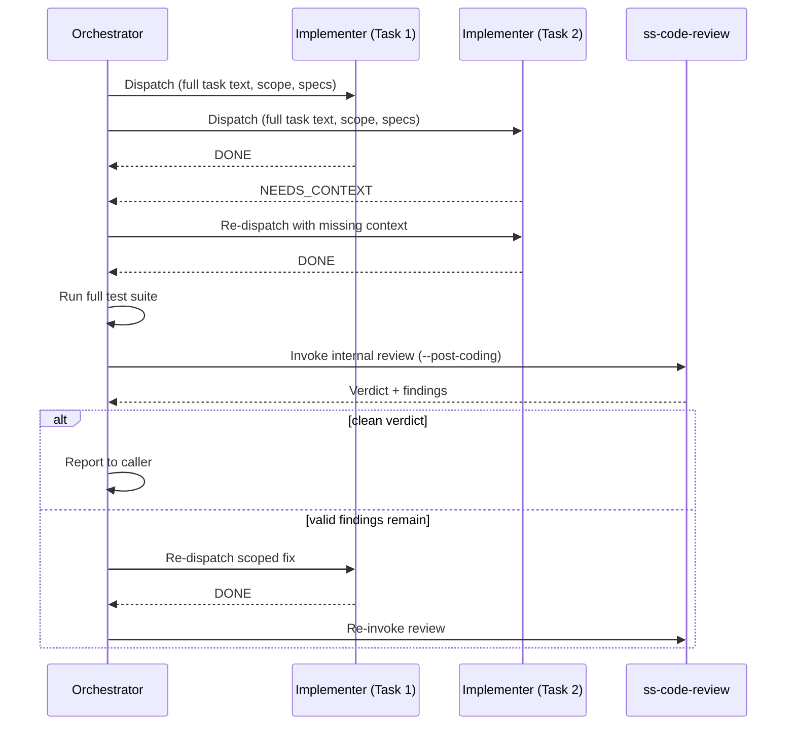

# Multi-Agent Collaboration

Two skills in SuperSpec — `ss-coding` and `ss-code-review` — get their names from the same idea applied to two different problems: instead of one agent doing everything in a single long-running context, split the work across several agents that each hold a narrower, more focused context, and let a coordinating agent manage the handoffs. `ss-coding` splits *implementation* across parallel task-scoped agents; `ss-code-review` splits *review* across independent, dimension-scoped agents. Together they form the coding-and-review step that every workflow in [workflows.md](./workflows.md) calls as a single unit.

## Why Split the Work

A single agent implementing an entire plan accumulates context across every task it touches — by task ten, it's carrying the weight of tasks one through nine, and that weight both slows it down and biases what it notices. A single agent reviewing its own work has an even sharper problem: it's checking the reasoning it just used to write the code, which is exactly the reasoning most likely to contain a blind spot it can't see.

Splitting fixes both. An implementer agent gets exactly one task, described completely, with no history to carry — its output isn't shaped by what it did three tasks ago. A reviewer agent gets one dimension to check — general correctness, or spec compliance, or cross-task integration — and never sees what another reviewer found, which is what keeps one agent's read from anchoring another's.

## Orchestrator Discipline

In both skills, the agent running the skill — the orchestrator — never writes code and never reviews code itself. Its job is narrower and more mechanical: read the plan or the diff, dispatch the right agents with the right context, collect what comes back, and decide what happens next. If the orchestrator starts editing a source file directly, or starts adding its own opinion to a review report, the whole point of the split is gone — the very bias that motivated dispatching a separate agent has crept back in through the coordinator instead.

The corollary is the **zero-context assumption**: every dispatched agent starts cold, with no memory of the plan, the codebase, or any other agent's work. Everything it needs — the full task description, not a pointer to a file to go read; the relevant specs; the files it's allowed to touch — has to be handed to it explicitly in the dispatch prompt. Making a subagent read the plan file itself wastes its context budget and risks it misreading scope; pasting the task in full costs a little more prompt length but removes that risk entirely.

## `ss-coding`: Parallel TDD Implementation

### Specs and Living-Spec Discovery

Before dispatching a single agent, the orchestrator reads the project's `CLAUDE.md` / `AGENTS.md` for referenced spec paths and test/lint commands, and checks for an active OpenSpec change under `openspec/changes/` (excluding anything already archived). If the plan references a specific change, that one applies; if exactly one active change exists, it's used without asking; if several exist and none is referenced, the orchestrator asks which one applies. The delta specs under that change's `specs/*/spec.md` are then injected into every implementer prompt as binding requirements — not as background reading, but as the acceptance criteria the self-review checklist checks against. A repository with no `CLAUDE.md`/`AGENTS.md` and no OpenSpec structure simply proceeds without spec injection; that gap is noted in the final report rather than silently assumed away.

This discovery step is also where `TEST_COMMAND` and `LINT_COMMAND` get determined — from documented project commands, `package.json` scripts, build files, or CI configuration — so that every implementer verifies against the same commands the orchestrator will later use for the full test suite.

### Input Routing

The skill accepts either a structured execution plan (task and step headings, a file list per task — typically what `ss-plan` produces) or a short natural-language change description with no such structure. Structure-free input first gets turned into a plan; anything already structured with two tasks or fewer skips straight to an **inline quick mode** that dispatches a single implementer per task without the full parallel machinery — small changes don't benefit from orchestration overhead they'd otherwise pay for.

### Dependency Grouping and Dispatch

Tasks are grouped by declared dependency: everything in one group can run in parallel, because nothing in it depends on anything else in it; the next group only starts once the previous one is fully done. Within a group, up to five implementer agents run concurrently — past that, batch into sub-groups rather than firing off more at once, both to bound resource contention and to keep any file-level conflict between parallel agents easy to trace back to a specific pair.

Each implementer works through the same loop regardless of how many others are running alongside it: write a failing test, run it and confirm it fails, implement, run it and confirm it passes, move to the next step in its task. Commits happen per task, formatted the way the task specifies, on the same feature branch every other implementer in this run is using.

### Status Vocabulary and Escalation

An implementer never just silently succeeds or silently gets stuck — it reports back with one of a small set of statuses, and the orchestrator has a defined response to each:

| Status | Meaning | Orchestrator response |
|---|---|---|
| `DONE` | Complete, no doubts | Check off the task, move on |
| `DONE_WITH_CONCERNS` | Complete, but the implementer flagged something | Address blocking concerns before continuing; log non-blocking observations for the final report |
| `NEEDS_CONTEXT` | Missing information to proceed | Supply what's missing, re-dispatch |
| `BLOCKED` | Something fundamental needs to change first | Work an escalation ladder: more context → a stronger model → break the task down → only then involve the user |
| `PLAN_ISSUE` | The plan itself is factually wrong | Pause dispatch, fix the specific error if it's localized, otherwise stop and get user confirmation before continuing |
| `CONFLICT` | Git conflict with a parallel sibling | Pause that group, resolve sequentially, resume |

The same discipline applies to errors: the same failure recurring on the same task a third time stops the loop and escalates rather than trying a fourth time with no change in approach — repetition without a change in context, model, or scope isn't debugging, it's stalling.

### The Plan File as Persistent State

Checking off a task's checkbox in the plan file the moment it completes does double duty: it's the progress record for this run, and it's also what makes the workflow-level resumability described in [workflows.md](./workflows.md) work — a session that gets interrupted mid-plan can be picked back up by reading which boxes are already checked, without redoing finished work.

## Role Prompt Templates

Every implementer dispatch and every reviewer dispatch follows the same prompt shape, kept as a shared template in `skills/_references/` rather than rewritten inline each time a skill needs one. `implementer-prompt.md` is the coding side of this; `ss-code-review` carries the equivalent structure for each reviewer role it dispatches. The shared shape exists because the zero-context assumption above imposes the same requirements on every dispatch, no matter which skill is doing the dispatching:

- **The full task or diff, pasted in** — never a path for the subagent to go read itself.
- **Scene-setting context** — where this piece fits in the larger plan or change, so the agent isn't just executing in a vacuum.
- **A scope boundary** — exactly which files it may touch (implementer) or which lines it may flag (reviewer: only lines actually modified in this diff, tagged `NEW`; anything on an untouched line is `PRE-EXISTING` and gets discarded, not reported).
- **An escalation path** — what to do when something is unclear, phrased as permission to stop and ask rather than guess.
- **A self-review pass before reporting** — did I do the whole task, does this follow repo conventions, are there debug artifacts left behind — so obviously incomplete or sloppy work doesn't reach the orchestrator in the first place.
- **A fixed status vocabulary** — the table above for implementers; `APPROVED` / `NEEDS_CHANGES` / `CRITICAL_ISSUES` for reviewers — so the orchestrator can route the response programmatically instead of parsing free text.

Centralizing the template means a change to, say, the escalation ladder or the self-review checklist gets picked up by every skill that dispatches that role, instead of having to be hunted down and edited in three places that have already started to drift from each other.

## `ss-code-review`: Multi-Dimensional Parallel Review

Where the coding skill splits work by *task*, the review skill splits it by *dimension* — several agents look at the same diff through different lenses, in total isolation from one another:

| Dimension | Checks | What it's handed |
|---|---|---|
| General quality | Bugs, correctness, architecture, test quality, production readiness | The full diff, plus PR/MR title and description |
| Spec compliance (core) | Security, testing standards, commit format | The diff, plus the guardrails core rulebook |
| Spec compliance (stack) | Naming, API patterns, error handling, language idiom | The diff, plus the guardrails file for the project's detected language |
| Spec compliance (project) | Project-specific conventions, if any are documented | The diff, plus whatever project rules exist |
| OpenSpec compliance (when specs are present) | Delta specs match the change: requirements covered, scenarios accurate, nothing silently dropped | The diff, plus the `openspec/` files it touches |
| Integration (post-coding only) | Do the pieces fit together — compatible interfaces, no orphaned code, consistent naming, no architectural drift from the plan | The diff, plus the plan's stated goal and architecture, plus the task-to-file mapping |

The OpenSpec dimension only dispatches when the diff touches `openspec/`-related files. The integration dimension only runs when this review is being invoked from inside a coding pass — it needs a plan to check integration *against* — and even then only when the change is large enough to plausibly have an integration problem (roughly, three or more tasks or five or more files). Below that threshold, there isn't enough surface area for pieces to fail to fit together.

Every agent scores its own confidence (0–100) on every finding it reports; the orchestrator's role is strictly to filter by a threshold and deduplicate, never to re-score or add its own read on a finding. A finding two independent agents both flagged is kept once, noted as independently corroborated, rather than reported twice. Severity then rolls up into one verdict: any high-confidence critical finding makes the whole review `CRITICAL_ISSUES`; any high-confidence important finding without a critical one makes it `NEEDS_CHANGES`; only-minor or no findings makes it `APPROVED`.

### Confidence Scoring

The 0–100 confidence score each reviewer attaches to its own findings isn't a vague gut feeling — it maps to how directly the finding traces back to evidence:

| Range | What it means |
|---|---|
| 90–100 | An explicit rule is violated and the code clearly violates it, or the bug has direct evidence |
| 75–89 | The rule strongly implies this, and the violation is likely |
| 50–74 | Genuinely ambiguous — could be intentional, could be a violation |
| Below 50 | Speculative; doesn't hold up to scrutiny |

The threshold filter discussed above discards anything below the high-confidence band, which is what keeps the consolidated report free of "maybe this is an issue" noise — a finding either clears the bar with real evidence, or it doesn't make the report at all.

## Guardrails as the Shared Rulebook

The spec-compliance reviewers don't go looking for rules on their own — the relevant `ss-guardrails` file (`core.md` always, the matching language file when one applies) is pasted directly into the dispatch prompt, and the reviewer is explicitly scoped to flag only what that pasted text actually says. This keeps a spec-compliance finding traceable to a specific documented rule rather than a reviewer's general sense of good style, and it keeps the three compliance dimensions from overlapping — core, stack, and project each check their own slice and nothing else. The general-quality reviewer is the one dimension that isn't guardrails-bound; it's judging correctness and design on its own reasoning, which is exactly why it runs as a separate agent from the compliance checks rather than folded into them.

## The Fix Loop

When the verdict isn't clean, `ss-code-review` doesn't just hand back prose — in post-coding mode it returns a structured, machine-parseable finding list: each entry carries a severity, which reviewer found it, the affected files, and a task hint the coding orchestrator uses to route the fix to the implementer who owns that area, rather than re-dispatching everyone. The coding skill re-dispatches only the implementers a finding actually maps to, re-runs tests, and re-invokes the review — bounded to a small number of cycles internally, on top of which the calling workflow keeps its own separate ceiling (see [workflows.md](./workflows.md)) since this loop is the same one workflows drive from the outside.

## Model Selection

Not every implementer needs the same amount of reasoning power, and paying for more than a task needs is waste. Task signal drives the choice:

| Signal | Model tier |
|---|---|
| One or two files, a clear spec | Fastest / cheapest tier |
| Multi-file change, some integration work | Mid tier |
| Architectural judgment, broad codebase context | Strongest tier |

Two things override the initial pick regardless of the signal that suggested it: a task touching four or more files gets upgraded before dispatch, and a `BLOCKED` report on retry gets upgraded rather than retried on the same tier — repeating a task on the model that just failed it, unchanged, isn't a fix. The integration reviewer in `ss-code-review` always runs on the strongest tier regardless of the rest of the review's sizing, since judging whether independently-built pieces cohere needs the broadest context window of any role in either skill.

## Anti-Patterns

| Anti-pattern | Why it hurts | Do this instead |
|---|---|---|
| Orchestrator edits a source file directly | Erases the isolation the whole split was designed to provide, and the edit gets no independent review | Always dispatch, never edit directly |
| Dispatching a reviewer per finished task | Redundant with the consolidated review pass, and misses cross-task issues a per-task view can't see | Let implementers self-check; review the assembled whole once, collectively |
| Letting a subagent read the plan or diff itself instead of pasting it in | Wastes its context budget and risks it misreading scope | Paste the full task or diff into the dispatch prompt every time |
| Sharing one reviewer's findings with another before both report | Anchors the second agent's judgment on the first's, destroying the independence that catches more issues in the first place | Keep every reviewer isolated until all have reported; consolidate only after |
| Retrying a failed task with no change in context, model, or scope | Definition of insanity — nothing about the retry addresses why it failed the first time | Change something concrete before retrying: more context, a stronger model, or a smaller task |
| Accepting "looks fine" from a reviewer with no file:line evidence | Not an actual review, just a rubber stamp | Re-dispatch once with an explicit instruction to cite evidence; accept only if it still comes back empty on the second try |
| Presenting a stub or simplified version as a finished task | The orchestrator and the user both believe the work is complete when it isn't | Finish the task as scoped, or report `BLOCKED` — never quietly narrow it |

## Where This Fits

From a workflow's point of view, `ss-coding` and its internal call into `ss-code-review` are one opaque step: hand it a plan, get back either a clean verdict or a list of findings to triage. Everything in this document — task splitting, the shared prompt templates, dimension-scoped review, guardrails-bound findings — is what makes that single step trustworthy enough for a workflow to treat it as a black box and move straight to opening a PR when it comes back clean.
