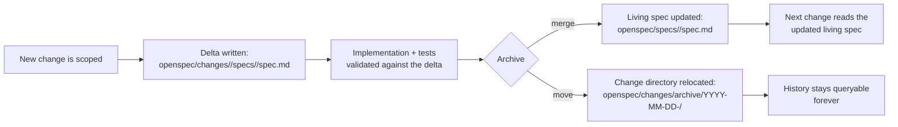
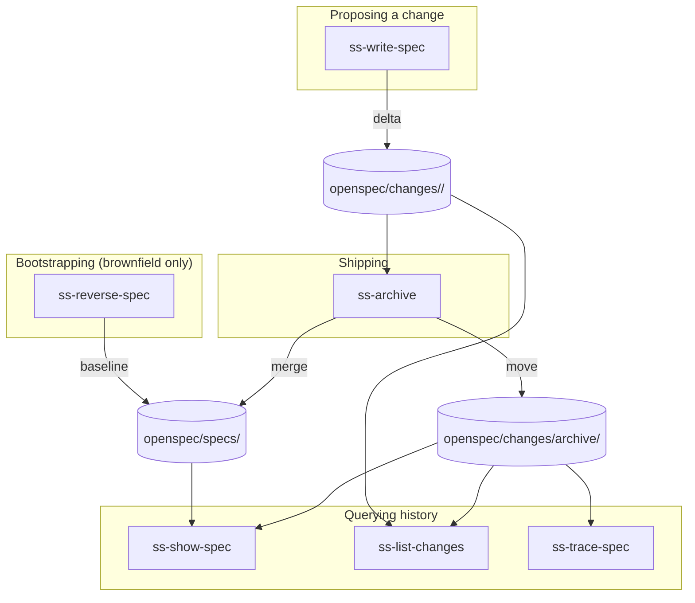

# Spec-driven development: living specs for evolving systems

## The problem

Most AI-assisted delivery workflows produce two kinds of documents on the way to shipping a change: a proposal ("why and what") and a plan ("how, task by task"). Both are consumable — once the pull request merges, nobody reopens them. That creates three compounding problems:

- **Design intent evaporates into git history.** The reasoning behind a decision lives in a markdown file nobody re-reads, or worse, only in a chat transcript. Every new request forces an agent (or a human) to reverse-engineer intent from the code itself.
- **There's no snapshot of "what the system currently does."** Truth is scattered across source code, old requirement docs, and tribal knowledge. Before touching anything, an agent has no single place to check "will this break an existing guarantee?"
- **Changes aren't expressed as a diff against anything.** A proposal is free-form prose. It's not machine-readable, so there's no reliable way to tell which capabilities are new, which are modified, and which are being retired — that judgment call is left entirely to manual review, and breaking changes slip through.

Spec-driven development closes this gap by keeping one living document per capability — a **spec** — that represents the system's current, authoritative behavior. Every change to that behavior is expressed as an explicit **delta**: a diff-like statement of what's being added, modified, or removed. Deltas get merged into the living spec and archived once the change lands, so the spec is always current and the history of how it got there is always retrievable.

This isn't a novel idea — it's the model popularized by [OpenSpec](https://github.com/Fission-AI/OpenSpec), and this document describes how SuperSpec's skills implement that model without depending on OpenSpec's own CLI. The file formats are intentionally compatible: a repository using `openspec/` conventions can be worked on by both OpenSpec's own tooling and SuperSpec's skills without conflict.

## Core idea

Three concepts do all the work:

1. **A living spec per capability.** `openspec/specs/<capability>/spec.md` is the source of truth for what a single capability (a coherent slice of business behavior, not an endpoint or a class) is guaranteed to do right now.
2. **A delta per change.** Instead of editing the living spec directly, an in-flight change writes `openspec/changes/<change-id>/specs/<capability>/spec.md`, a delta file that says exactly what it adds, changes, or removes for that capability.
3. **Archival as the merge step.** Once a change ships, its delta is merged into the corresponding living spec, and the change directory moves into `openspec/changes/archive/`. The spec advances; the reasoning behind that step is preserved forever, just no longer "in the way."

Nothing here requires a CI job, a database, or a bespoke CLI. Every operation is an agent reading and writing markdown files under version control, which means the mechanism works identically whether a human or an AI agent drives it, and it diffs cleanly in any pull request.

## Directory layout

```
<repo>/
├── openspec/
│   ├── specs/                          # living specs — source of truth
│   │   ├── order-refund/
│   │   │   └── spec.md
│   │   └── order-create/
│   │       └── spec.md
│   └── changes/                        # in-flight and archived deltas
│       ├── add-order-refund/           # an active change
│       │   ├── proposal.md             # why & what, optional
│       │   └── specs/
│       │       ├── order-refund/
│       │       │   └── spec.md         # delta: ADDED requirements
│       │       └── order-create/
│       │           └── spec.md         # delta: MODIFIED requirements
│       └── archive/
│           └── 2026-05-10-add-payment-callback/
│               ├── proposal.md
│               └── specs/
│                   └── order-payment/
│                       └── spec.md
└── src/
```

A few conventions worth calling out:

- **A change can touch multiple capabilities.** `add-order-refund` might add a brand-new `order-refund` capability while modifying an existing `order-create` requirement — each gets its own delta file under the same change directory.
- **Capability names are stable, kebab-case noun phrases** (`order-refund`, `user-auth`), chosen for the business domain they represent rather than for a class or module name. They can be renamed via a delta, but splitting them casually defeats the purpose — aim for roughly a handful to a few dozen requirements per capability, not one per endpoint.
- **`proposal.md` lives inside the change directory**, not just linked from elsewhere. Once a change is archived it needs to be self-contained; a soft reference into a separate `docs/proposals/` folder would go stale the moment the directory moves.
- **This directory is a project asset the user owns**, not a SuperSpec working file — it's meant to be committed, reviewed in pull requests, and read by the next contributor (human or agent) exactly like the code it describes.

## The Requirement / Scenario format

Every spec, whether living or delta, is built from the same two-level structure: a **Requirement** (a single guarantee the system makes) containing one or more **Scenarios** (concrete, testable WHEN/THEN cases that prove the guarantee holds).

```markdown
## ADDED Requirements

### Requirement: Users can request a refund
The system SHALL allow the placing user of a paid order to request a full or partial
refund, provided the refund amount does not exceed the amount actually paid.

#### Scenario: Full refund succeeds
- **WHEN** a user requests a $100 refund on order #1001 (paid in full: $100)
- **THEN** the system creates a refund record with status PENDING
- **AND** the payment gateway is called asynchronously within 24 hours
- **AND** on success, the order status becomes REFUNDED

#### Scenario: Refund amount exceeds what was paid
- **WHEN** a user requests a $150 refund on order #1001 (paid: $100)
- **THEN** the system rejects the request with error code REFUND_AMOUNT_EXCEEDS
```

Modifying an existing capability follows the same shape, but the delta must carry the *entire* requirement forward, not just the part that changed:

```markdown
## MODIFIED Requirements

### Requirement: Order state machine
**Reason:** Adding a REFUNDED state to support the refund flow.

An order SHALL transition through CREATED → PAID → SHIPPED → COMPLETED; any order not
in CREATED or CANCELED SHALL be able to transition to REFUNDING → REFUNDED.

#### Scenario: Completed order gets refunded
- **WHEN** a refund is requested on a COMPLETED order
- **THEN** the order transitions to REFUNDING, then REFUNDED on success

## REMOVED Requirements

### Requirement: Legacy manual reconciliation endpoint
**Reason:** Superseded by the automated refund flow.
**Migration:** Callers should switch to `POST /api/refund/v2/reconcile`.
```

The rules that make this machine-mergeable, borrowed directly from OpenSpec:

1. Section headers must match exactly: `## ADDED Requirements`, `## MODIFIED Requirements`, `## REMOVED Requirements`, `## RENAMED Requirements`.
2. Each requirement starts with `### Requirement: <name>` — the name must be unique within the living spec once merged.
3. Every requirement needs **at least one** scenario, headed with exactly four hashes: `#### Scenario: <name>`. Three hashes is the single most common formatting mistake in this scheme and silently breaks tooling that greps for the pattern.
4. WHEN/THEN/AND lines use bold markers: `- **WHEN** ...`, `- **THEN** ...`, `- **AND** ...` for continuations.
5. A `MODIFIED` entry copies the requirement's full prior content before editing it — never just a diff of the changed sentence. Archival needs the complete picture to merge correctly, and reviewers need it to judge the change.
6. A `REMOVED` entry always includes `**Reason:**` and `**Migration:**` — a capability doesn't just disappear; callers need a path forward.
7. A `RENAMED` entry uses `FROM: <old name> → TO: <new name>`, plus body content only if the meaning changed alongside the name.
8. Requirement language uses SHALL / MUST / MAY / SHOULD deliberately and consistently — these are load-bearing words, not stylistic choices.

The living spec itself carries a short provenance header so nobody mistakes it for something safe to hand-edit:

```markdown
# Capability: order-refund

> Source of truth — maintained by the `ss-archive` skill from merged deltas.
> Do not edit directly. Create a delta via `ss-write-spec`, then archive it.

**Last archived change:** add-order-refund-cancellation (2026-06-02)

## Purpose
...

## Requirements
...
```

Editing a living spec by hand defeats the whole point: the next archive pass has nothing to reconcile against, and the audit trail breaks. If a requirement needs to change, it always goes through a delta.

## The lifecycle: delta → archive → authoritative spec



Archival is deliberately **agent-driven merge**, not a scripted find-and-replace. A regex-based merge has to replace requirements wholesale and chokes on partial edits or mixed-language content; an agent reading both the delta and the current living spec can apply a surgical change — add one scenario, tweak one sentence — while leaving the rest of the requirement untouched. This mirrors OpenSpec's own recommended path for programmatic merges versus agent-assisted ones, and it's the reason SuperSpec doesn't ship a merge script: the `ss-archive` skill does the merge by reading and editing markdown directly.

Archival is also **idempotent**. Running it against a change that's already archived, or one that never produced a delta (a documentation-only or pure-refactor change — see "how much ceremony" below), is a safe no-op rather than an error. That property is what lets a "ship it" skill call archive unconditionally as a first step without worrying about double-applying anything.

Because archival is just file moves and merges, concurrent archival from two contributors is handled the same way any other concurrent git operation is: pull the latest state before merging, and let the agent resolve any conflict the same way it would resolve a merge conflict in code.

## How much ceremony does a change need?

Not every change deserves a full proposal-and-delta treatment. The right amount of spec ceremony scales with how much the change affects observable behavior:

| Change shape | Spec treatment |
|---|---|
| New capability or cross-cutting behavior change | Full delta: one or more `ADDED`/`MODIFIED` requirements, each with scenarios |
| Small, well-understood tweak (e.g., a validation rule) | Minimal delta: usually a single `ADDED` requirement |
| Pure refactor, docs, comments, CI config, dependency bumps | No delta at all — this is "zero-spec" and it's the correct outcome, not a shortcut being taken |

The dividing line is simple: **if the change alters what a caller or user can observe, it needs a delta, however small.** If it only rearranges how the system produces the same observable behavior, it doesn't. A coding workflow that finds itself modifying public behavior without a corresponding delta should stop and ask for one rather than silently proceeding or inventing a spec after the fact — a spec that's reverse-engineered from finished code has already lost its value as something that *guided* the work.

## Bringing an existing codebase into the model

A brownfield repository doesn't get to start with an empty `openspec/specs/` and call it done — that's the single biggest reason spec-driven setups stall out in practice: the directory exists, nothing is in it, and every future change looks like it's adding a "new" capability because there's no baseline to diff against.

The `ss-reverse-spec` skill exists specifically to solve this. Given a codebase with no spec history, it:

1. **Mines capability candidates** from multiple signals — route/controller/handler names, API definitions, database schema naming, and existing documentation — and cross-references them to avoid both over-splitting and missing whole areas of behavior.
2. **Asks for confirmation before committing to a capability list.** This is a hard gate, not a suggestion: an agent should never unilaterally decide how a codebase's behavior is carved up. The user merges, splits, renames, or drops candidates.
3. **Reverse-engineers one spec per confirmed capability**, in parallel, reading only the source that implements it and writing Requirement/Scenario pairs that describe observable behavior — never implementation detail ("uses a cache," "backed by a queue") that would tie the spec to something that's free to change later.
4. **Flags orphan code** — source that doesn't map cleanly to any confirmed capability — rather than silently omitting it or inventing a capability to hold it.
5. **Marks its own output as provisional**, with a header stating it was reverse-engineered at a specific commit and hasn't yet been through a real delta cycle. That header is a signal to a later `ss-archive` run that the spec may still need direct correction rather than a hard merge.

The output is a baseline, not a finished product. Reverse-engineered specs reflect what the code *does*, which is not always what it's *supposed* to do — a long-standing bug can look identical to a deliberate feature from the outside. That's exactly why a human review pass is mandatory before committing a reverse-engineered baseline: catching "this was actually a bug" is a judgment call no agent should make unsupervised.

`ss-reverse-spec` and `ss-write-spec` both know how to bootstrap the `openspec/` directory structure themselves the first time they're invoked in a project that doesn't have one yet — there's no separate initialization step required before either can run.

Two invocation modes cover the common cases:

| Mode | When to use it |
|---|---|
| Full baseline sweep | First adoption in an existing repository — scan everything, propose the full capability list |
| Single capability | Filling a gap later — a capability was skipped, discovered after the fact, or needs to be re-scoped |

There's no expectation of one-shot completeness. Reverse-engineering the five or ten highest-churn capabilities first, then filling in the rest as they come up, produces a better outcome than trying to cover everything at once and drowning the review pass in volume.

## Tracing what changed and why

The whole point of archiving instead of deleting is that history stays queryable. Three skills give an agent (or a human) three different grain sizes to query at:

| Question | Skill | What it reads |
|---|---|---|
| "What can this capability do right now?" | `ss-show-spec` | The living spec, plus a short list of its most recent archived changes |
| "What's in flight, and what shipped recently?" | `ss-list-changes` | Active entries under `openspec/changes/`, and the most recent archive entries |
| "When did this specific guarantee show up, change, or disappear?" | `ss-trace-spec` | Every archived delta, searched for a named requirement or scenario, returned in chronological order |

In practice, an agent about to touch behavior that a capability already governs should read the living spec first — that's the whole "spec-driven" part of spec-driven development. If the change modifies an existing requirement rather than adding a new one, it's worth pulling the last few archived deltas that touched that capability too: understanding *why* a guarantee reads the way it does today prevents accidentally re-introducing something a previous change deliberately removed.

## Where each skill sits in the lifecycle



- **`ss-write-spec`** is the plumbing skill that turns a proposal, a PRD, or a plain-language description of a change into one or more delta files. A planning or coding workflow can call it as an internal step so a delta gets produced without the user having to think about spec mechanics directly; it's also fine to call it standalone when the goal is to lock down a contract before any implementation work starts.
- **`ss-archive`** is the only skill that writes to a living spec. It merges deltas in, moves the change directory into `archive/`, and is safe to call repeatedly.
- **`ss-show-spec`**, **`ss-list-changes`**, and **`ss-trace-spec`** are read-only. None of them mutate `openspec/` — they exist purely to make the accumulated history usable.
- **`ss-reverse-spec`** is the one skill that writes directly to a living spec rather than through a delta, and only because there's no delta to merge yet — it's establishing the starting point that everything else works against.

## Anti-patterns

| Pattern | Why it hurts | Do this instead |
|---|---|---|
| One enormous delta covering 20+ requirements | Hard to review, high risk of a bad merge | Split into multiple changes, each scoped to one capability |
| Editing `openspec/specs/<cap>/spec.md` directly | Bypasses archival, breaks the audit trail, and creates conflicts the next real archive can't resolve | Always go through a delta, even for a one-line fix |
| Capabilities split at the level of individual endpoints | Duplicates what an API contract already describes; becomes unmaintainable | One capability per business-domain noun phrase, not per route |
| A `MODIFIED` entry that only states "changed field X" | Archival has nothing to merge against | Always carry the full prior requirement forward, then edit it |
| A `REMOVED` entry with no migration path | Callers are left stranded | Migration is mandatory, not optional, on every removal |
| Spec used as a PRD — business context, KPIs, screenshots | Loses the "observable, testable contract" focus that makes specs useful | Business rationale belongs in the proposal; the spec states only what's observably true |
| Skipping the delta for a change that clearly affects behavior | Forfeits the accumulated value of the living spec | Treat the compliance gate's pushback as a signal to go back and write the delta, not an obstacle to route around |
| Committing a reverse-engineered baseline without human review | A historical bug or a temporary hack can look identical to an intended feature from the code alone | Always review before committing; iterate the baseline over time rather than trying to get it perfect on the first pass |

## References

- OpenSpec: <https://github.com/Fission-AI/OpenSpec> — the methodology and file conventions this document builds on.
- Spec-Driven Development with OpenSpec: <https://intent-driven.dev/knowledge/openspec/>
