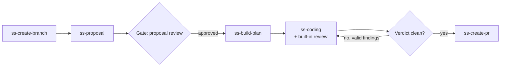
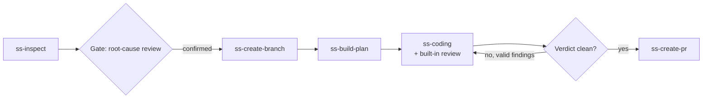
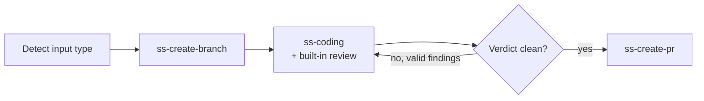

# End-to-End Workflows

super-spec ships three orchestrator skills that chain the individual skills — branch creation, proposal writing, planning, multi-agent coding, review, and PR creation — into a single request: `ss-feature-workflow`, `ss-troubleshooting-workflow`, and `ss-coding-workflow`. Without them, driving a change from idea to PR means invoking half a dozen skills by hand, in the right order, remembering to pass each one's output into the next, and remembering not to skip the review step. That's a lot of process to hold in your head, and it's easy to get wrong: skip the proposal and jump straight to coding, forget the review pass before opening a PR, or lose the thread of what a previous step produced because nothing carried it forward.

A workflow skill exists to remove that burden. It is not a new capability — every step it calls already exists as its own skill — it is the sequencing, the handoff of artifacts between steps, and the placement of the few points where a human genuinely needs to look before the assistant continues.

## Design Principles

**Thin orchestration.** A workflow skill contains no implementation logic of its own. It is a declarative sequence: call skill A, take its output, hand it to skill B, pause at the defined gates, report progress. All the actual work — writing a proposal, building a plan, writing code, reviewing a diff, opening a PR — lives in the skill being called. If you ever find yourself tempted to have a workflow skill reimplement part of what `ss-create-branch` or `ss-build-plan` already does, that's a sign the boundary has been crossed. Duplicated logic drifts out of sync; a single skill that owns a responsibility doesn't.

**Artifacts as state.** A branch, a proposal file, a plan with checkboxes, an open PR — each is already a durable record of "this step happened." Workflows don't need a separate state file to track progress; they read the repository. This is also what makes resuming after an interrupted session possible (see below).

**Human gates at points that matter.** Full automation sounds appealing until an AI-authored root cause turns out to be wrong and the entire fix built on it has to be redone. Gates are placed exactly where a wrong decision would be expensive to unwind: confirming a proposal before planning against it, confirming a root cause before branching to fix it. Everywhere else — including the code-review cycle — the workflow keeps moving on its own, because those steps are cheap to redo automatically if something comes back wrong.

**Ask, don't abort.** A missing tool, an unclear input, or being on the wrong branch when a workflow starts are all recoverable situations. The default response is to ask the user how to proceed, not to hard-stop the whole workflow and make them start over.

**Non-goals.** A workflow skill does not reimplement any step's logic, does not pull in an external orchestration framework, and does not aim for fully unattended execution on complex, multi-file changes — human judgment stays in the loop at the gates described below.

## The Three Workflows

| Workflow | Scenario | Input | Proposal step? | Plan step? | Default gate |
|---|---|---|---|---|---|
| `ss-feature-workflow` | New feature or requirement | PRD, requirement doc link, or plain-language description | Yes | Yes | Proposal review |
| `ss-troubleshooting-workflow` | Bug or incident fix | Issue link, alert reference, or problem description | No — a root-cause report stands in for it | Yes | Root-cause review |
| `ss-coding-workflow` | Executing an existing plan, or a small, well-scoped code change | A plan file, or a short natural-language change instruction | No | No — the input already is the plan, or is small enough to skip one | None |

All three converge on the same tail: dispatch the coding-and-review step, let it iterate to a clean verdict, then hand off to PR creation. What differs is what happens before that tail.

### ss-feature-workflow

1. Create the branch from the requirement's title or source link; the branch-creation skill infers a frontend/backend prefix on its own.
2. Write a proposal — backend or frontend template, chosen by the nature of the requirement; ask the user if that's ambiguous.
3. **Gate: proposal review.** Show the proposal summary and its path; wait for confirmation, a request to revise, or a decision to abort. This is the one point in feature work where being wrong is expensive — every downstream step assumes the proposal's architecture is correct.
4. Build the execution plan from the approved proposal.
5. Run coding and review to convergence (see below), then open the PR.

Scope: this workflow is for requirements substantial enough to warrant a written architecture decision before planning. If a requirement clearly needs code changes across more than one repository, hand off to a dedicated multi-repo workflow instead of continuing single-repo.

### ss-troubleshooting-workflow

1. Run the investigation skill to gather evidence from independent sources and converge on a root cause.
2. **Gate: root-cause review.** Show the conclusion and its supporting evidence; wait for confirmation, a request to re-investigate, or a decision to abort. This gate is non-negotiable — an incorrect root cause means every subsequent step, including the fix itself, has to be thrown away and redone.
3. Only after confirmation does branch creation happen — there's no point branching before you know the fix is worth making. Default branch prefix is `fix/`.
4. Build the fix plan from the confirmed root cause.
5. Run coding and review to convergence, then open the PR referencing the original issue.

The branch-creation ordering is the one structural difference from feature work: investigate first, then branch, rather than branch first.

### ss-coding-workflow

This is the workflow for two related but distinct inputs, auto-detected:

- **An execution plan** — a file with task/step structure, typically produced by `ss-build-plan` in an earlier session. Handed straight to the coding step.
- **A code-change instruction** — a short natural-language description of what to change. Handed to the coding skill's own inline quick-mode path, which skips full plan generation for changes that reduce to a task or two.

There is no proposal step and no separate planning step — the input already carries the plan, or is small enough that generating one would be overhead. Branch naming follows the plan's title, or a summary of the instruction with a prefix inferred from its nature (`feat/`, `refactor/`, …); ask if that inference is unclear. Because there's no architectural decision or root cause to get wrong upfront, this workflow has no default gate at all — the coding-and-review loop is the only checkpoint, and it doesn't pause for humans either (see below).

## The Coding-and-Review Loop Is One Step, Not Two

All three workflows call a single combined step for implementation: `ss-coding` runs its own review pass internally before returning. A workflow never calls the review skill on its own — doing so on top of a coding step that already reviewed itself would double the review effort and stack two independent retry-limit counters on top of each other, for no benefit. See [multi-agent.md](./multi-agent.md) for how that internal review works.

What the workflow *does* own is what happens with the verdict that step hands back:

- **Clean verdict** — proceed straight to PR creation. No gate.
- **Outstanding findings** — triage each one. A finding might be a false positive, out of scope for this change, or a deliberate design choice; record the reasoning and move on. A finding that's genuinely valid gets queued for a fix.
- **Valid findings exist** — call the coding step again, scoped to just those findings. It re-implements and re-reviews internally. Repeat from the top.

This is deliberately not gated — a review finding is cheap to act on automatically, unlike a wrong proposal or root cause. It does need a backstop, though: an unbounded retry loop can burn tokens indefinitely, and a genuinely stuck disagreement needs a human eventually. The workflow tracks its own retry ceiling (independent of any retry counting the coding step does internally, since that resets on every call and isn't visible one layer up) and its own recurrence count — the same finding surviving two consecutive workflow-level fix attempts is treated as a stuck loop, not a third try. Either limit being hit escalates to the user with the latest verdict and a clear list of what's fixed versus what remains. Every finding dismissed as invalid must carry a one-line reason in the log, so a human reviewer can spot-check that "invalid" wasn't just a shortcut to get the loop to end.

## Delivery Modes: Full and Lite

Not every change justifies a branch and a PR. A one-line fix or a quick local refactor often just needs to land as a clean commit. Rather than forcing every workflow through the same ceremony, each of the three supports two delivery modes that only affect the first and last step — everything in between, including the quality gates, is identical.

| | **full** (default) | **lite** |
|---|---|---|
| Start | `ss-create-branch` creates a branch (or an isolated worktree) | Stay on the current branch |
| Finish | `ss-create-pr` opens a PR, then `ss-cleanup` tidies up | Conventional-commit the work in place; push is optional |
| Output | A PR link | A summary of what changed and where it was committed |

Mode is decided once: an explicit user request always wins; otherwise the workflow asks at the start and proceeds with the answer for the rest of the run. It's a conversational choice, not a config file — nothing about the chosen mode gets written into the user's project. Neither mode changes what quality means: the same TDD discipline, the same multi-agent review, the same verification standard apply whether or not a PR ever gets opened. Lite mode is a shorter path to the same bar, not a lowered one.

PR creation itself adapts to what's actually available in the repository: it detects whether the remote is GitHub or GitLab and uses the matching CLI (`gh` or `glab`). If there's no recognized remote, no CLI installed, or the user simply declines, it doesn't fail the workflow — it falls back to a local commit plus a summary, exactly like lite mode's own finish line. A missing PR is a degraded outcome, not a broken one.

## Resumability: Artifacts as Checkpoints

Sessions get interrupted. Rather than tracking progress in a side file, a workflow probes the repository at startup and skips whatever it can already see is done.

| Step | Signal that it's already complete | Behavior on match |
|---|---|---|
| Branch creation | Current branch isn't the default branch | Reuse it |
| Root-cause investigation | A recent root-cause report already exists | Ask whether to reuse it |
| Proposal writing | A recent, matching file exists under the proposals directory | Reuse it |
| Plan building | A structured plan (tasks, file lists) already exists | Reuse it |
| Coding | Every task checkbox in the plan is already checked | Skip straight to the review loop |
| PR creation (full mode) | An open PR already exists for this branch | Report its link instead of opening a new one |
| Commit (lite mode) | The latest commit already references this plan or instruction | Report it instead of committing again |

This probing is also what makes the human gates safe to interleave with real work: if a session is resumed after a proposal was already approved, the workflow sees the approved proposal on disk and doesn't re-open the gate — it moves straight to planning.

## Cross-Host Portability

Every skill in super-spec, workflows included, is a single markdown file interpreted by whichever host is running it — Claude Code, OpenAI Codex, Pi, or OpenCode. That single-source approach only holds up if the workflow body doesn't quietly assume host-specific behavior:

- **Gates render differently, not differently in substance.** A host with structured interactive prompts shows the gate as a choice; a host that only supports free-form conversation shows the same choice as a text question and waits for a reply. The workflow's job is to make the pause and its options explicit either way — never to assume a UI affordance that might not exist.
- **Skill-to-skill invocation reliability varies.** Some hosts chain a call from one skill into another deterministically; others treat it as a strong hint that a capable model usually follows but isn't guaranteed to. Because of that gap, a workflow's step list is always spelled out explicitly ("now call `ss-build-plan` with this input") rather than implied — on a host where chaining is less reliable, an explicit instruction in the skill body is the difference between the workflow completing and it stalling silently after one step.
- **One source, documented differences.** Rather than fork the workflow per host, differences in reliability and gate presentation are called out inline in the skill body, so the same file stays the single source of truth across all four.

## Boundaries

A workflow skill is an optional layer on top of skills that remain independently useful — nothing stops a user from invoking `ss-build-plan` or `ss-create-pr` directly instead of going through a workflow.

| Anti-pattern | Why it hurts | Do this instead |
|---|---|---|
| Reimplementing a called skill's logic inside the workflow body | Two places now hold the same logic, and they drift apart the first time only one gets updated | Call the skill; treat its output as an opaque artifact |
| Hard-stopping on a failed preflight check | Throws away a session over something recoverable — a missing CLI, an unclear input | Ask the user how to proceed; only a handful of things (e.g., no way to read the source document at all) are genuine hard failures |
| Dropping the proposal or root-cause gate to "go faster" | A wrong architecture or wrong root cause propagates through every downstream step before anyone catches it | Keep both gates on by default; treat skipping them as an explicit, informed choice, not the default |
| Calling the review skill separately after the coding step already ran its own internal review | Doubles the review effort and stacks two independent retry ceilings on top of each other | Let the coding step's internal review verdict drive the fix loop; never invoke review a second time on the same change |
| Re-running every step from scratch after an interrupted session | Redoes work that's already sitting in the repository as a finished artifact | Probe for existing branches, proposals, plans, and PRs first; skip whatever's already done |
| Treating a missing PR-hosting CLI as a hard failure | The change itself is still done — only the last, optional step couldn't run | Fall back to a local commit plus a summary; report it as a degraded outcome, not a broken workflow |
