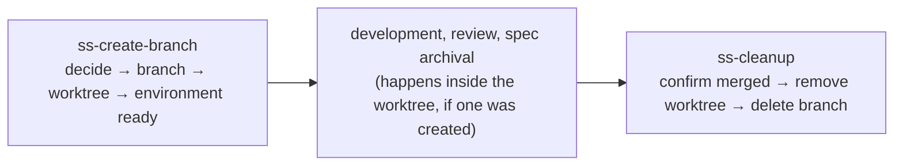
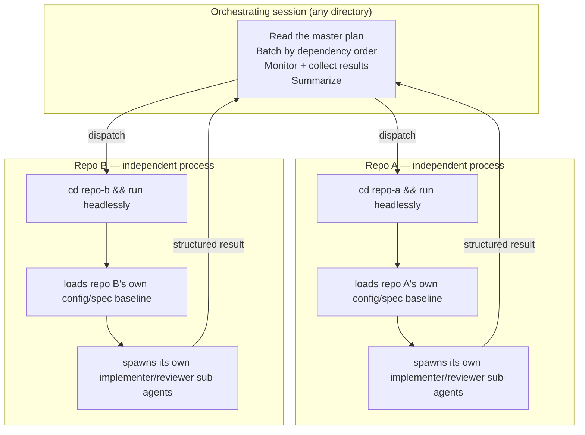

# Isolating parallel work: worktrees and multi-repo orchestration

## The problem

An agent-driven workflow eventually runs into the same limitation a human developer hits: one working copy can only be on one branch at a time. Left unaddressed, that constraint shows up in two related but distinct ways.

**Within a single repository**, developing in place means checking out the feature branch directly in the main working copy. That blocks anything else that would want to touch the same checkout: you can't glance at the default branch, you can't pick up an urgent second task, and a workflow that gets interrupted mid-task leaves a dirty working copy that the next task has to fight through. Nothing manages the lifecycle of an isolated workspace end to end — creating one is a manual step, and cleaning one up after the fact is easy to forget.

**Across repositories**, a single requirement or bug fix can legitimately span more than one codebase — a backend service and its consuming frontend, or two services on either side of an API contract. A workflow built to orchestrate one repository doesn't generalize to that case just by adding more file access: giving an agent read/write access to a second repo's directory doesn't load that repo's own configuration, its own project conventions, or its own spec baseline. Everything that makes an agent behave correctly in a given repo is scoped to that repo, and bolting on a second directory doesn't carry any of it along.

This document covers both problems, because they share a root cause — a single working context isn't enough once more than one thing needs to happen at once — and because the same skills (`ss-create-branch`, `ss-cleanup`) show up in the solution to each.

---

## Part 1 — Worktree isolation within a repository

### Why git worktrees

A git worktree is a second working directory attached to the same repository, checked out to a different branch, sharing the same object store. It gives a feature branch its own directory without cloning the repository again, and without ever touching the branch the main checkout happens to be on.

This is the same approach recommended by the public [`superpowers`](https://github.com/obra/superpowers) skill collection's `using-git-worktrees` guidance, and SuperSpec follows its core sequence closely: detect any isolation that already exists, prefer a host tool's native worktree support when one is available, and fall back to plain `git worktree` commands when it isn't.

### Detecting existing isolation first

Before creating anything, check whether the current session is already isolated:

1. **Is a worktree for the target branch already registered?** `git worktree list --porcelain` is the single source of truth — if the branch already has a worktree, reuse it by switching into that directory rather than creating a second one.
2. **Is the current session already inside a worktree (and not inside a submodule)?** Compare `git rev-parse --git-dir` against `git rev-parse --git-common-dir`: when they differ and the session isn't inside a submodule (submodules also report differing paths, so this check only confirms rather than rules out), the session is already isolated. If the current branch already matches the target, just keep working there; otherwise, switch branches inside that same worktree instead of nesting a new one.
3. Only after both checks come up empty does a new worktree get created.

This ordering matters: creating a worktree inside a worktree is a footgun, and reusing an existing one is almost always the right move when a branch already has a home.

### Creating a worktree

When a new worktree is genuinely needed, prefer whatever native tooling the host agent environment provides (Claude Code, for instance, has first-class worktree support that keeps the session's own notion of "current directory" in sync automatically — always prefer that over fighting the harness with raw shell commands). Where no native tool exists, fall back to plain git:

```bash
git fetch origin
git check-ignore -q .worktrees || echo '.worktrees/' >> .gitignore
git worktree add .worktrees/<flattened-branch> -b <branch> origin/<base-branch>
cd .worktrees/<flattened-branch>
```

A few conventions make this predictable:

- **Location:** `.worktrees/` at the repository root — inside the project, not a sibling directory. A sibling directory (`../repo-wt`) can silently fall outside an agent's permitted working directories, and it survives (as an orphan) if the main repo is ever deleted; a directory inside the repo does neither.
- **Naming:** slashes in the branch name get flattened to dashes — `feat/refund-precision` becomes `.worktrees/feat-refund-precision` — so the directory name maps back to the branch unambiguously without needing a separate lookup table.
- **Safety check:** confirm `.worktrees/` is actually git-ignored before creating anything under it, and add it to `.gitignore` if it isn't. That write should go in *without* being auto-committed — the main checkout is very likely still sitting on whatever branch the user was already on (often the default branch), and a silent commit there pollutes its history and can break a later fast-forward pull. Surface the pending `.gitignore` change and let the user fold it into their next commit.
- **Discovery stays stateless:** everything about which worktrees exist is derived from `git worktree list --porcelain` at query time. There's no separate manifest file to keep in sync or let drift.

### Getting the environment ready

A fresh worktree starts empty of anything git doesn't track — submodules aren't checked out, and installed dependencies aren't there. Before handing the workspace back for development:

- Initialize any submodules the project depends on (`git submodule update --init --recursive`), since project conventions, shared configuration, or spec baselines can live in one.
- Install dependencies according to the stack in play (a lockfile-driven install, a module download, or whatever the project's own build tooling expects), running anything long as a background step rather than blocking on it.
- Skip a full baseline test run by default — a worktree freshly cut from the default branch's HEAD has zero code changes in it, so the baseline is whatever the remote's CI already reports for that commit. Reserve an explicit "verify baseline first" option for cases where that remote signal isn't trusted.

### Deciding whether to use a worktree at all

Not every task needs isolation, and asking every single time gets old fast. The decision order, from most to least specific:

1. **An explicit choice on the invocation** — pass a flag to use a worktree, or a flag to develop in place, and that settles it for this run.
2. **A standing team convention** — if a project's own contributing guide documents a default (e.g., "we always work in worktrees here"), a contributor or an automated workflow can simply always pass the matching flag and never hit the next step. SuperSpec's skills don't write this convention into the project themselves; recording and following it is left to the team, the same way any other project convention is. One machine-readable way to record it is an `SS-WORKTREE` managed block in `AGENTS.md` — `ss-create-branch` looks for exactly this key:

  ```markdown
  <!-- SS-WORKTREE:START -->
  ss:worktree-default: worktree   <!-- or: in-place -->
  <!-- SS-WORKTREE:END -->
  ```
3. **Ask once** — with no explicit signal either way, ask whether this task should use an isolated worktree, and mention that a standing convention avoids the question going forward.

An unattended workflow that reaches step 3 with nobody available to answer should default to creating a worktree — isolation is the safer failure mode, and the choice gets recorded in whatever report the workflow produces.

### Lifecycle and command responsibilities



| Stage | Responsibility |
|---|---|
| `ss-create-branch` | Decides whether to isolate (per the order above), creates the branch, creates the worktree if applicable, switches the session into it, and gets the environment ready. |
| Everything in between (coding, review, spec archival, opening a pull request) | Operates *inside* whatever workspace it's handed. It only needs to notice which environment it's in — it never creates or tears one down itself. |
| `ss-cleanup` | Confirms the change has actually merged, switches the session back to the main checkout, removes the worktree, and deletes the branch. |

Keeping creation and teardown concentrated in two skills, with everything else a pure "user" of whatever workspace already exists, is what keeps the lifecycle from getting tangled — a review or archival step never has to reason about whether it's safe to make or destroy a worktree, because that was already decided upstream.

### Removing a worktree safely

`ss-cleanup` removing a worktree is not a plain `git worktree remove` — worktrees that have initialized submodules refuse a bare removal, and that refusal on its own doesn't mean there's anything to lose. The distinction that matters:

- **Only the submodule is blocking removal, and the worktree itself is otherwise clean** (`git status --porcelain --ignore-submodules=none` in that directory reports nothing beyond the submodule guard): force-remove without asking — there's genuinely nothing to lose.
- **There are real uncommitted changes**, submodule-internal or otherwise: surface exactly what would be discarded and require explicit confirmation before forcing the removal. A blanket `--force` here would silently discard work with no further warning.

Before switching the main checkout back to the default branch, check that the main checkout itself is clean first. If it's dirty, don't switch silently — a plain `git checkout` carries uncommitted changes onto the target branch and then onto every subsequent branch cut from it. Report what's dirty and let the user choose to discard it, deal with it first, or skip the branch switch for now.

### Edge cases worth knowing about

| Situation | Handling |
|---|---|
| The target branch already has a worktree | Switch into it; never create a second one for the same branch |
| Currently inside a worktree, asked to start another branch | Switch branches inside the current worktree rather than nesting |
| `.worktrees/<name>` exists on disk but isn't a registered worktree (leftover from an interrupted run) | `git worktree add` will refuse and `prune` won't help — confirm with the user, then clear the directory and retry |
| Worktree creation is denied (sandboxing, permissions) | Fall back to developing in place, and say so explicitly rather than failing silently |
| `.gitignore` can't be written to | Report it and ask: fall back to in-place development, or have the user resolve it and retry |
| A worktree still has uncommitted changes at cleanup time | Require explicit confirmation (or an explicit force flag) before discarding anything |

### Where this fits relative to branch/PR delivery style

Worktree isolation is about *where* work happens — a separate directory versus the main checkout. It's an orthogonal decision from *whether* a workflow creates a branch and opens a pull request at all versus committing in place on the current branch. A task can combine either choice with either delivery style; picking to isolate doesn't imply anything about whether a pull request eventually gets opened, and vice versa.

---

## Part 2 — Orchestrating a requirement across repositories

### Why a single agent session can't just span repos

The obvious-looking shortcut — give one agent session access to two repositories' directories and let it work across both — breaks down for a structural reason, not a permissions one: a repo's own configuration (its conventions file, its spec baseline, anything that shapes how an agent should behave in that codebase) is scoped to that repo's root. Handing a session extra directory access doesn't load any of that; it only grants file access. The agent ends up working in a second codebase with none of the context that makes it behave correctly there.

Nesting a sub-orchestrator per repository — one agent that spawns a second layer of agents for each repo, each of which spawns its own implementers — sounds like the natural fix, but runs into hard platform limits: most agent CLIs cap how many layers of sub-agents can nest, and even where nesting is technically permitted, it doesn't solve the configuration-loading problem above, because a nested sub-agent still runs inside the *parent's* directory-scoped session rather than a fresh one rooted in the target repo.

### The design: one independent process per repository

The one thing every major agent CLI supports is running itself **headlessly** — a fire-and-forget invocation, given a prompt, that runs to completion without a human in the loop. That's the actual building block: for each repository involved, start a separate, independent agent process with its working directory set to that repository's root.



Because the process for repo A actually `cd`s into repo A before starting, it naturally loads repo A's own configuration and spec baseline — the "which context applies here" problem disappears by construction, without any extra plumbing. And because each of those processes is a complete, independent agent instance, it's free to spawn its own internal sub-agents for implementation and review exactly as it would for a single-repo task — the "two layers of parallelism" aren't nested inside one session; they're two genuinely separate layers, process-level isolation on the outside and normal sub-agent parallelism on the inside.

The isolation this buys is between repositories, not a security sandbox — every agent CLI's internal sandboxing has known gaps once nesting or unattended automation is involved, so the actual safety boundary here is the surrounding environment: a trusted development machine or container, branch protection on the target repositories, and human review of the resulting pull requests. Don't rely on any agent's internal sandbox to be the last line of defense in a multi-process setup like this.

### The orchestrator's job, and what it explicitly doesn't do

The orchestrating session is deliberately thin. It:

- Reads (or, if only a requirement description was given, first produces) a **master plan** naming every repository involved, their local paths, which batch each belongs to, and any dependency between batches.
- Presents that plan for a **go/no-go confirmation** before dispatching anything — with multiple repositories about to be changed at once, this is a stronger gate than a single-repo workflow needs, and skipping it should require an explicit opt-in, not be the default.
- Copies each repository's own slice of the plan into that repository before starting its process — a sub-process should never have to reach across repository boundaries to find its own instructions.
- Dispatches one independent process per repository in the current batch, running them in parallel; batches with a dependency between them run one after another, never overlapping.
- Waits for a structured result from each process (see below), and checks every single one individually rather than treating "most of them succeeded" as good enough.
- On completion, produces one cross-repository summary: what shipped where, what still needs human sign-off, and a suggested merge order when one repository's change depends on another's.

What it never does: touch source code in any of the target repositories, or make an implementation decision on their behalf. Every actual line of code is written by a per-repository process, inside its own repository, using the same review-and-verification path a single-repo change would go through.

### Ground rules the orchestrator holds itself to

- **Every dispatched process runs unattended.** A process with nobody available to answer a mid-task question will simply hang until it times out, so any decision that genuinely needs a human has to happen either before dispatch (as part of the go/no-go gate) or after a process reports back blocked (as an escalation) — never by expecting an answer mid-run.
- **Parallelism only within a batch; batches run in dependency order.** If repo B's process consumes an API that repo A's process is introducing, A's batch has to fully complete before B's batch starts.
- **A repository's slice of the plan is delivered to it before its process starts** — never fetched by the process reaching outside its own directory.
- **Every repository's result is checked, not sampled.** A summary that reports overall success while quietly omitting one failing repository is worse than no summary.
- **No unauthorized scope-cutting.** If five repositories were in scope, the job isn't done until all five have shipped or a specific one has been explicitly deferred with the user's sign-off — never silently narrowed to "the ones that worked."

### Reading results back

For an orchestrator to make batch-to-batch decisions programmatically, each per-repository process needs to end with something machine-parseable rather than free-form prose. A fixed result block at the end of its final output — status, branch name, pull request URL, review verdict, verified test commit, and task completion count — lets the orchestrator `grep` it out of the process's log reliably:

```
---RESULT---
status: SUCCESS | FAILED | BLOCKED
branch: feat/refund-support
pr_url: https://github.com/<owner>/<repo>/pull/123
review_verdict: APPROVED
tasks_completed: 5/5
blocker: <one-line reason, only when status isn't SUCCESS>
---END-RESULT---
```

A `FAILED` or `BLOCKED` result triggers a look at that repository's own log to find the cause. Something transient (a flaky network call, a bit of missing context) can be worth a bounded number of automatic retries; anything else pauses the whole workflow and escalates to the user with the failing repository's log excerpt attached — while letting the rest of the current batch run to completion rather than blocking on the one repository that's stuck.

### When a single-repo workflow discovers it isn't single-repo after all

A workflow that starts out assuming one repository doesn't always know that up front — a request can turn out to span repositories partway through scoping. Rather than teaching every single-repo workflow how to handle that case internally (which just duplicates multi-repo logic in several places and lets it drift), the right move is to **detect and hand off**: the moment a single-repo workflow recognizes cross-repository scope, it stops and transfers what it has produced so far — an already-drafted plan, an already-created branch, whatever exists — to the multi-repo workflow described above, rather than trying to muddle through it single-repo.

A rough ordering of how confidently that hand-off should be triggered:

| Confidence | Signal | Action |
|---|---|---|
| Certain | A plan explicitly names more than one repository, or several sub-plans each name a different repository | Hand off directly |
| High | File paths in a plan point outside the current repository's root; a written proposal explicitly lists more than one affected repository | Ask for confirmation, then hand off |
| Heuristic | The original request names two or more services/repos by name in plain language | Ask, showing the evidence for why this looks cross-repo |
| Not a signal | A shared API-contract repository being touched separately; a documentation reference to another service without touching its code; multiple modules changing inside one repository | Stays single-repo |

Whichever workflow detects the hand-off carries along everything already produced — the original request, any draft plan or branch, and which confidence level triggered the move — so the multi-repo workflow can pick up from there instead of starting over.

### Mapping to the skills

| Concern | Skill |
|---|---|
| Deciding on and creating an isolated worktree for a single repository's branch | `ss-create-branch` |
| Removing a worktree and its branch once a change has shipped | `ss-cleanup` |
| Reading (or producing) a master plan, dispatching one process per repository, batching by dependency, and rolling up results | `ss-multi-repo-workflow` |

Everything a per-repository process does once it's running — creating its own branch, developing, running review, archiving a delta spec, opening a pull request — is the same single-repo path described elsewhere in this project, invoked with exactly the same skills a human working in that one repository would use directly. Multi-repo orchestration doesn't introduce a second way of doing that work; it just decides *when* and *where* to kick off however many copies of it need to run at once.
