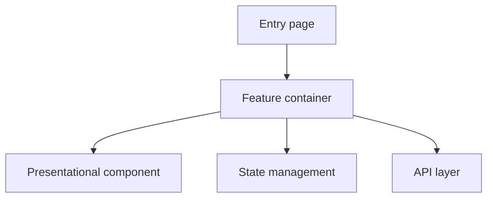

# {Requirement Name} - Frontend Technical Proposal

## Revision History

| Version | Date | Author | Notes |
|---------|------|--------|-------|
| V1.0 | YYYY-MM-DD | xxx | Initial draft |

---

## 1. Requirement Background

### 1.1 Background

- Why this is needed:
- Current pain points:
- Expected benefit:

### 1.2 Scope

- New pages:
- Modified pages:
- New capabilities:
- Out of scope:

### 1.3 Success Criteria

- Functional acceptance criteria:
- Performance acceptance criteria:
- UX acceptance criteria:

## 2. Glossary

| # | Term | Description |
|---|------|-------------|
| 1 | xxx | xxx |
| 2 | xxx | xxx |

## 3. Related Documents

| Document type | Name / Link | Takeaway |
|----------------|-------------|----------|
| Task tracker | [link] | task breakdown, priority, boundaries |
| PRD | [link] | user goals, page flow, constraints |
| Backend design doc | [link] | API contract, field definitions, integration dependencies |
| Design mockups (Figma) | [link] | page structure, component states, visual spec |
| Related code / prior proposals | [link] | reusable implementation, historical differences |

## 4. High-Level Design

### 4.1 Design Goals

- What this proposal must achieve:
- Constraints:
- Design principles:

### 4.2 Technical Overview

- Page and module breakdown:
- Component tree / page hierarchy:
- State management approach:
- Data flow approach:
- Routing and navigation approach:
- **Repositories Involved:** (every repository that needs a code commit; for a single-repo change, list the current repo name. Exclude the shared API-contract repo and the specs submodule. Downstream workflows use this field for multi-repo routing.)

### 4.3 Architecture Diagram

> Use Mermaid, PlantUML, or ASCII art to show the relationships between pages, components, state, and APIs.



### 4.4 Options Considered

| Dimension | Option A | Option B | Recommended |
|-----------|----------|----------|--------------|
| Implementation cost | | | |
| Maintainability | | | |
| Performance | | | |
| Risk | | | |

## 5. Backend API Dependencies

### 5.1 Endpoint List

| Endpoint | Method | Purpose | Call timing | Cache strategy | Failure handling |
|----------|--------|---------|--------------|-----------------|-------------------|
| GET /api/xxx | GET | xxx | on page load / on switch | none / cache Xm | retry / degrade / notify |

### 5.2 Field Mapping

| Backend field | Frontend field | Type | Notes |
|----------------|-----------------|------|-------|
| xxx | xxx | string | xxx |

### 5.3 Integration Dependencies

- Which backend capabilities this depends on:
- Any endpoints/fields that still need to be added:
- Error code and empty-state conventions:

## 6. Implementation Details

### 6.1 Page Structure

- Page decomposition:
- Component responsibility boundaries:
- Reuse strategy:

### 6.2 State Management

- Global state:
- Local state:
- Server-state caching:
- Cross-component communication:

### 6.3 Interaction States

- Normal:
- Loading:
- Empty:
- Error:
- Edge case:

### 6.4 Key Implementation Points

#### 6.4.1 [Implementation point name]

**Current state**:

**After the change**:

**Why**:

**Pseudocode / structure sketch**:

```ts
// core logic only
```

### 6.5 Routing Design

- New routes:
- Route guards:
- Navigation flow:

## 7. User Story Breakdown

| # | User story | Deliverable | Dependency | Acceptance method |
|---|------------|-------------|------------|---------------------|
| 1 | As a xxx, I want xxx | xxx | xxx | xxx |
| 2 | As a xxx, I want xxx | xxx | xxx | xxx |

## 8. Risk Assessment

| Risk | Likelihood | Impact | Mitigation |
|------|------------|--------|------------|
| Browser compatibility | Low/Medium/High | xxx | xxx |
| Performance risk | Low/Medium/High | xxx | xxx |
| Dependency change risk | Low/Medium/High | xxx | xxx |

## 9. Test Recommendations

### 9.1 Test Scope

- Page rendering:
- Interaction flows:
- Error scenarios:
- Regression scope:

### 9.2 Suggested Test Cases

| Scenario | Expected result |
|----------|------------------|
| First load | xxx |
| API failure | xxx |
| Empty data | xxx |

### 9.3 Additional Coverage

- Unit tests:
- Component tests:
- E2E / smoke tests:

## 10. Rollback, Observability & Version Compatibility

### 10.1 Rollback

- Rollback switch:
- Rollout strategy:
- Post-rollback behavior:

### 10.2 Observability

- Tracking events:
- Logging:
- Alerts:
- Key metrics:

### 10.3 Version Compatibility

- Old/new version compatibility:
- API compatibility:
- Data compatibility:
- Degradation strategy:
