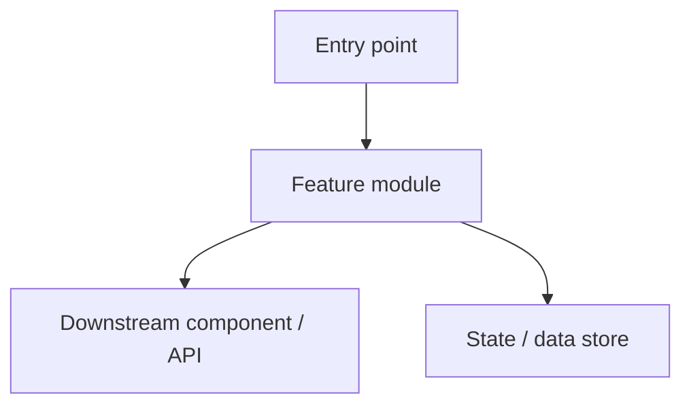

# {Requirement Name} - Technical Proposal

> This template covers both backend and frontend (or full-stack) proposals. Fill in every section that applies to this repository's shape; skip a subsection only when it plainly doesn't apply (e.g., a pure backend service skips 4.3 UI Contracts). Do not skip a section just because it's harder to fill in.

## Revision History

| Version | Date | Author | Notes |
|---------|------|--------|-------|
| V1.0 | YYYY-MM-DD | xxx | Initial draft |

---

## 1. Overview

### 1.1 Problem Statement

> - **Background**: [why this is needed, what problem it solves]
> - **Summary**: [one or two sentences summarizing the requirement]
> - **Goals**: [measurable acceptance criteria]
> - **Non-Goals**: [explicitly out of scope, so reviewers don't assume otherwise]

### 1.2 Terminology

| # | Term | Description |
|---|------|-------------|
| 1 | xxx | xxx |

### 1.3 Related Documents

| Document | Role | Owner |
|----------|------|-------|
| PRD | Product | xxx |
| API spec (OpenAPI) | Backend | xxx |
| Companion proposal (backend/frontend counterpart) | — | xxx |
| Design mockups (Figma or similar) | Design | xxx |
| Task tracker link | PM | xxx |

---

## 2. Scope & Boundary

### 2.1 Repository Boundary

- **In scope**: what this repository will implement (functionality, endpoints, pages, or features)
- **Out of scope**: what belongs to other repositories, marked as an external dependency
- **Integration points**: APIs to call/expose, cross-app navigation, shared components

**Repositories Involved:** <every repository that needs a code commit; for a single-repo change, list the current repo name. Exclude the shared API-contract repo and the specs submodule. Downstream workflows use this field for multi-repo routing.>

### 2.2 Success Criteria

- Functional acceptance criteria:
- Performance acceptance criteria (if applicable):
- UX acceptance criteria (if applicable):

---

## 3. Summary Design

### 3.1 Current State

Describe the current architecture and flow relevant to this change:

- Core call chain or page/component structure (what exists, how the pieces interact)
- Key data flow
- (Recommended) architecture or sequence diagram

### 3.2 Affected Components

Mark which applications/services/modules this change touches:

| Component | Change Type | Notes |
|-----------|-------------|-------|
| xxx-service / xxx-page | Modified | xxx |
| xxx-job / xxx-module | New | xxx |

### 3.3 Target Design & Data Flow

Describe the target architecture after the change:

- New/modified components and their responsibilities
- Interaction between components (sync / async / event-driven / message queue / client-server request)
- (Recommended) target architecture or data-flow diagram



### 3.4 Alternatives Considered (optional)

When multiple viable approaches exist:

| Dimension | Option A | Option B |
|-----------|----------|----------|
| Implementation cost | X person-days | X person-days |
| Performance / UX impact | ... | ... |
| Extensibility / maintainability | ... | ... |
| Risk | ... | ... |

**Recommended option:** Option A, because: [reasoning]

---

## 4. Key Interfaces & Contracts

> Fill in the subsections that apply to this repository. This section defines contracts — not implementations.

### 4.1 API Design (if this repository exposes or consumes APIs)

#### Changes to Existing Endpoints

| URL | Description | Change | Notes |
|-----|--------------|--------|-------|
| GET /api/xxx | xxx | added field xxx | — |

#### New Endpoints

| URL | Description | Notes |
|-----|--------------|-------|
| POST /api/xxx | xxx | — |

New endpoint definitions:

**POST /api/xxx**

- Request:

```json
{
  "field1": "string",
  "field2": 0
}
```

- Response:

```json
{
  "code": 0,
  "data": {}
}
```

#### Internal RPC / Message Queue Interfaces (optional)

| Interface / Topic | Type | Producer | Consumer | Notes |
|--------------------|------|----------|----------|-------|
| xxx_topic | Kafka | xxx-service | xxx-job | xxx |

#### Field Mapping (for a consuming frontend)

| Backend field | Frontend field | Type | Notes |
|----------------|-----------------|------|-------|
| xxx | xxx | string | xxx |

### 4.2 Data Model (if this repository owns persisted data)

#### New Tables

```sql
CREATE TABLE xxx (
    id BIGINT NOT NULL AUTO_INCREMENT,
    -- ...
    PRIMARY KEY (id),
    KEY idx_xxx (field1, field2)
) ENGINE=InnoDB DEFAULT CHARSET=utf8mb4 COMMENT='xxx';
```

#### Table Alterations

```sql
ALTER TABLE xxx ADD COLUMN new_field VARCHAR(64) DEFAULT '' COMMENT 'xxx';
```

#### Cache Design (optional)

| Key format | Value | TTL | Notes |
|------------|-------|-----|-------|
| `prefix:{id}` | JSON | 5min | xxx |

#### Configuration Changes (optional)

| Config key | Value | Notes |
|------------|-------|-------|
| xxx.enabled | true | feature flag |

### 4.3 UI Contracts (if this repository renders UI)

#### Component / Page Inventory

For each new or changed UI unit, specify:

| Component / Page | Props / Input | Internal State | Exposed Events / Callbacks | Notes |
|-------------------|----------------|------------------|------------------------------|-------|
| xxx | xxx | xxx | xxx | xxx |

#### State Management

- Global state (structure: fields + types):
- Local state:
- Server-state caching:
- Cross-component communication:

#### Page/Screen States

Every affected page or screen covers:

| Page/Screen | Normal | Loading | Empty | Error | Edge Case |
|-------------|--------|---------|-------|-------|-----------|
| xxx | xxx | xxx | xxx | xxx | xxx |

#### Routing / Navigation (if applicable)

- New routes:
- Route guards / auth checks:
- Navigation flow:

### 4.4 Change Points

For each significant change point:

#### 4.4.1 [Change point name]

**Why this change is needed**:

**Current approach** (prose, with a short code/pseudocode reference only if needed to pin down a contract):

**New approach** (prose, with a short code/pseudocode reference only if needed to pin down a contract):

**What changes**:

1. Change 1
2. Change 2

> Do not expand this into a full implementation or a file-by-file edit list — that level of detail belongs to `ss-plan` and the coding phase.

#### 4.4.2 [Change point name]

(same structure as above)

---

## 5. Non-Functional Design

### 5.1 Performance Requirements (if applicable)

- API response time < XXXms (P95/P99)
- Throughput > XXX QPS
- Estimated data volume: xxx

### 5.2 Compatibility & Migration

- **Forward compatibility**: how old requests/data/clients are handled
- **Rollout strategy**: staged rollout support?
- **Rollback plan**: rollback steps and blast radius
- **Data migration**: migration and rollback approach, if any
- **Version compatibility** (for frontend/client work): old/new client compatibility, API compatibility, degradation strategy

### 5.3 Observability (optional)

- Key metrics to monitor
- Logging
- Alert thresholds and notification channels
- Tracking events (for UI-facing work)

---

## 6. Risk Assessment

| Risk | Likelihood | Impact | Mitigation |
|------|------------|--------|------------|
| Performance risk | Low/Medium/High | xxx | xxx |
| Data consistency issue | Low/Medium/High | xxx | xxx |
| External dependency unavailable | Low/Medium/High | xxx | xxx |
| Browser/device/platform compatibility | Low/Medium/High | xxx | xxx |

---

## 7. Testing Recommendations

### 7.1 Test Scope

- Core logic / rendering:
- Interaction and integration flows:
- Error scenarios:
- Regression scope:

### 7.2 Suggested Test Cases

| Scenario | Expected result |
|----------|------------------|
| First load / happy path | xxx |
| Upstream/API failure | xxx |
| Empty data | xxx |

### 7.3 Additional Coverage

- Unit tests:
- Integration / component tests:
- E2E / smoke tests:

---

## 8. Milestones

| # | Milestone / deliverable | Scope | Dependency | Acceptance method |
|---|--------------------------|-------|------------|---------------------|
| 1 | xxx | xxx | xxx | xxx |
| 2 | xxx | xxx | xxx | xxx |

---
