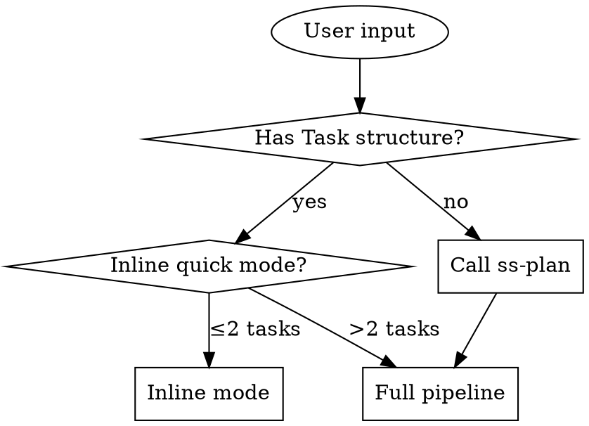
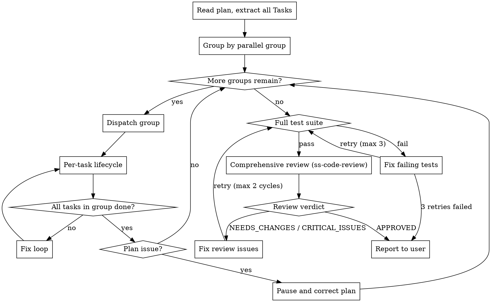

# Multi-Agent Parallel TDD Development

Execute an implementation plan by dispatching multiple subagents in parallel, each following test-driven development, then hand off to the `ss-code-review` skill for one comprehensive review pass once every task passes its tests.

**Core architecture:** the orchestrator (you) never writes code. You read the plan, dispatch subagents, track progress, and collect results. All code is written by implementer subagents.

**Zero-context assumption:** each implementer subagent starts with a fresh context and no knowledge of the codebase. You must hand it everything it needs — full task text, context, specs, and a scope boundary.

## Inputs

This skill expects one of:
- a path to a plan file already broken into tasks (produced by the `ss-plan` skill);
- a link to an external requirement or design document (wiki page, ticket, PRD);
- a plain-language description of the requirement.

If none of these is supplied, ask the user for one before proceeding.

## Iron Rules

Violating any of these means stop and escalate to the user:

1. **The orchestrator never writes code.** You dispatch, track, and review status. You never directly edit source files. (Non-source edits — updating plan checkboxes, correcting plan text — are fine.)
2. **Review is delegated to `ss-code-review`.** Once all tasks complete and tests pass, invoke it in post-coding mode. Do not dispatch your own per-task reviewers.
3. **Continuous execution.** Don't pause between tasks to ask "should I continue?" Run until every task is done or blocked.
4. **Respect parallel boundaries.** Subagents in the same parallel group may run concurrently; subagents in different groups must run sequentially.
5. **No file conflicts.** Parallel subagents must never modify the same file. If the plan has parallel tasks touching the same file, run them sequentially instead.
6. **Three strikes and you stop.** The same error on the same task, three times, means stop and report to the user. "Same error" means the same failing test case, the same compiler/lint error at the same file:line, or the same exception type from the same stack-trace origin — different messages on different lines count as separate errors.
7. **Scope breach is a hard stop.** If a subagent modifies files outside its task's file list, reject the work and re-dispatch with an explicit constraint.
8. **Specs are binding.** Any specs discovered for the repository apply to every implementer prompt.
9. **Never implement directly on the trunk branch (main/master).** If the current branch is main/master, stop and ask the user to create a feature branch first (the `ss-create-branch` skill can do this).
10. **Deliver full scope — no silent reduction.** Execute every task in the plan. Never skip a task, stub out logic, or downgrade an implementation to a "simplified version" to finish faster, and never re-scope the plan into "MVP now, phase two later" on your own initiative. If the full plan can't be completed, stop and report the blocker — never present partial work as complete. Exception: scope the user explicitly cut, deferred, or accepted as blocked. Record that decision under a "User-Confirmed Scope Adjustments" section in the plan file (the persistent record the downstream review reads) and repeat it in the final report.

## Input Routing



**How to detect Task structure:** the document contains `### Task N` headings with `- [ ] Step` checkboxes and `**Files:**` sections.

**Validation gate:** if a task has no `**Files:**` section, stop. The plan is incomplete — report it to the user.

| Input | Detection | Action |
|---|---|---|
| `ss-plan` output | file under `docs/plans/`, has Task/Step structure | execute (inline or full) |
| Plain-language requirement | plain text, no Task structure | run `ss-plan` on the text, then execute |
| Link to an external doc | a URL rather than a local file path | run `ss-plan` on the link, then execute |
| Local markdown (requirement/proposal) | `.md` file without Task structure | run `ss-plan` on the path, then execute |
| Proposal-writing output | file under `docs/proposals/`, has architecture but no Tasks | run `ss-plan` on the path, then execute |

**Edge case — plan has 0 tasks:** tell the user "the plan is empty, nothing to execute."

**Edge case — tasks exist but no parallel-group markers:** treat all tasks as one sequential group, executed in order.

## Inline Quick Mode

When the plan has two tasks or fewer, skip the full parallel pipeline and execute directly:
1. Dispatch a single implementer subagent per task (sequentially).
2. Run the tests.
3. Invoke `ss-code-review` in post-coding mode (it skips Integration Review for small scope).
4. Handle any review feedback.
5. Report.

Small plans don't benefit from parallel-orchestration overhead — direct execution is faster. Inline mode still enforces TDD, spec compliance, the scope boundary, and the git strategy below.

## Specs & Commands Discovery

Before dispatching any subagent:
1. Read `CLAUDE.md` and/or `AGENTS.md` at the project root for project-specific rules.
2. Always inject the shared guardrails: `../ss-guardrails/core.md`, plus the guardrails file matching the project's primary stack (`../ss-guardrails/java.md`, `go.md`, `cpp.md`, `web.md`, `android.md`, `ios.md`, or `flutter.md`). Detect the stack from the project's build files/manifests; inject all files that apply if more than one stack is present.
3. Discover test and lint commands:
   - check `CLAUDE.md`/`AGENTS.md` for documented commands;
   - check `package.json` scripts (Node projects);
   - check `Makefile`, `build.gradle`, or `pom.xml` (for the respective stack);
   - check `Taskfile.yml` or CI workflow files.
   Record these as `TEST_COMMAND` and `LINT_COMMAND` for use during execution.
4. If neither `CLAUDE.md` nor `AGENTS.md` exists, skip project-specific spec injection (the guardrails still apply) and note in the final report: "No project-specific specs were found."

## OpenSpec Discovery

Before dispatching any implementer:
1. Discover active changes under `openspec/changes/`, excluding `archive/`.
2. If the plan file references an OpenSpec change, use that change ID.
3. If exactly one active change exists, use it.
4. If multiple active changes exist and none is referenced by the plan, ask the user which one applies.
5. Read every delta spec under `openspec/changes/<change-id>/specs/*/spec.md` and inject them into implementer prompts as binding requirements.

If the project has no `openspec/` structure yet, this discovery step simply finds nothing — creating that structure is out of scope here (see the `ss-write-spec` / `ss-reverse-spec` skills).

## Git Strategy

**Environment:** work in whatever directory the branch-creation step produced — an isolated worktree or the main checkout in place both work identically here. This skill never creates or removes worktrees or branches itself. Before starting, confirm the guardrails files are present (`../ss-guardrails/core.md` exists); if not, proceed without guardrails injection and note it in the final report.

All implementers work on the same feature branch (the current branch):
1. Before starting, verify the current branch is not main/master (Iron Rule 9).
2. Each implementer commits using the task's specified commit-message format.
3. Parallel-agent conflict handling: if an implementer can't commit because of a conflict with a parallel agent, it reports `CONFLICT`. Resolve it by pausing the rest of that group, resolving the conflict sequentially, then re-running tests for the affected tasks.
4. After all tasks complete, do not push — leave that decision to the user.

**Progress tracking:** update the plan file's checkboxes as tasks complete (`- [x]`). This lets execution resume if the session is interrupted.

## Execution Process



### Step 1: Read the Plan & Extract Tasks

1. Read the plan file once; extract every task with its full text.
2. Note parallel-group assignments and dependency relationships.
3. Order groups by dependency (group A before group B if B depends on A).
4. Mark the plan file with progress as tasks complete (update checkboxes).

### Step 2: Dispatch by Parallel Group

For each parallel group, in dependency order:
- **1 task:** dispatch a single implementer subagent.
- **2-5 tasks:** dispatch implementer subagents in parallel, one per task.
- **6+ tasks:** batch into sub-groups of at most 5, run sub-groups sequentially.

Parallel dispatch limit: 5 subagents at a time. For long operations (build, install, full test suite), run them in the background rather than blocking on anything that takes more than about 30 seconds.

### Step 3: Per-Task Lifecycle

For every task, whether parallel or sequential:
1. Dispatch an implementer subagent using the `../_references/implementer-prompt.md` template.
2. Handle the status it reports:
   - `DONE` → task complete, update the plan checkbox.
   - `DONE_WITH_CONCERNS` → check the `blocking_concerns` field: non-empty means address it first and re-dispatch; only `observations` means the task is complete (log the observations for the final report).
   - `NEEDS_CONTEXT` → supply the missing context and re-dispatch.
   - `BLOCKED` → escalate (see "Handling Subagent Status" below).
   - `PLAN_ISSUE` → pause execution (see "Plan Correction").
   - `CONFLICT` → resolve sequentially (see "Git Strategy").

There is no per-task review — code review happens collectively via `ss-code-review` in post-coding mode after all tasks complete and tests pass (Step 6). This avoids redundant per-task reviews and enables cross-task integration analysis.

Implementer self-checks are still required. Each implementer must follow TDD (write a failing test, implement, verify it passes), run the lint command on changed files, self-verify against specs before reporting `DONE`, and include test output in its status report.

### Step 4: Plan Correction (mid-execution)

If an implementer discovers the plan has factual errors (wrong file paths, wrong assumptions, missing dependencies):
1. **Pause** — stop dispatching new tasks.
2. **Assess** — is this localized to one task, or systemic (an architectural assumption is wrong)?
3. **Localized fix** — correct the specific task in the plan file and continue.
4. **Systemic issue** — report to the user and wait for confirmation before continuing.

This is not license to redesign the plan — only factual errors warrant correction.

### Step 5: Full Test Suite

Run `TEST_COMMAND` (discovered during Specs & Commands Discovery).

If all tests pass: record the current HEAD commit SHA (`git rev-parse HEAD`) and proceed to the comprehensive review (Step 6). Include this test-verified SHA in the final report so a downstream `ss-create-pr` run can skip a redundant re-test.

If tests fail:
1. Identify which tasks caused the failures by correlating failing tests with changed files.
2. Re-dispatch the affected implementers with the failure details.
3. Re-run the full test suite.
4. Maximum 3 full-suite retry cycles; after 3 failures, report to the user with the failing tests listed.

Also run `LINT_COMMAND` if one was discovered — lint failures follow the same fix cycle.

### Step 5.5: Spec Compliance Gate

Run this after tests/lint pass and before `ss-code-review`:
1. Check for delta specs under `openspec/changes/<change-id>/specs/`.
2. If none exist, decide whether this is zero-spec mode: auto-allow only when the changed files are limited to docs, comments, CI/build configuration, dependency metadata, or tests. Otherwise stop with: "This change affects system capability but has no delta spec. Run the `ss-write-spec` skill to add one, then continue — or explicitly confirm this is a zero-spec change."
3. If a delta exists, verify coverage: for every Requirement and every Scenario, find an automated test covering its WHEN/THEN behavior (test names should map to Requirement/Scenario names where practical). If coverage is missing, report `NEEDS_TEST` with the uncovered scenarios listed.
4. Re-dispatch implementers to add the missing tests, then rerun tests and this gate.
5. Maximum 2 compliance cycles; if still uncovered, stop and escalate to the user.

This gate validates spec coverage only — it doesn't rewrite or invent specs during coding. Missing or incorrect specs get fixed by going back to `ss-plan` or `ss-write-spec`.

### Step 5.6: Full-Scope Gate

Run this after the Spec Compliance Gate and before `ss-code-review`. It verifies nothing was silently narrowed during execution:
1. **Task completeness** — every task in the plan is checked off, and a task may only be checked off once all of its steps are done. A stubbed or partially implemented task stays unchecked and blocks this gate.
2. **Scope-reduction scan** — grep the newly added/modified code for deferral markers: `TODO`, `FIXME`, "for now", "simplified", "not implemented", "placeholder", "stub", and hardcoded values standing in for real logic. Each hit is a judgment call, not an automatic failure: a genuine deferral must be completed before proceeding; a confirmed false positive (a UI `placeholder=` attribute, a test double, deliberate fail-fast on an unsupported path, ordinary comment phrasing) gets dismissed with a one-line reason in the report.
3. **On failure** — re-dispatch the affected implementers to finish the work. Don't rationalize a gap as "MVP scope," "phase two," "optional," or "nice to have" — re-scoping decisions belong to the user alone.
4. **Exception** — scope the user explicitly cut, deferred, or accepted as blocked is exempt. Append each item to a "User-Confirmed Scope Adjustments" section in the plan file (citing the user's instruction), then repeat it in the final report. The plan file is the authoritative record — `ss-code-review` and later stages read the authorization from there, not from chat output.

**Downstream contract:** the final report includes `TEST_VERIFIED_SHA`. When `ss-create-pr` runs immediately after this skill with no new commits and a clean working tree, it can detect this SHA and skip its own pre-flight test suite. The full test suite is only re-run there when new commits were added after this step, a rebase introduced changes, or this skill wasn't used at all (standalone `ss-create-pr`).

### Step 6: Comprehensive Review

After tests pass, invoke `ss-code-review` in post-coding mode, providing:
- the plan file path (goal, architecture, task list);
- the task-to-file mapping (which task changed which files);
- the current branch diff against the target branch.

Handle the review verdict:

| Verdict | Action |
|---|---|
| `APPROVED` | proceed to report |
| `NEEDS_CHANGES` / `CRITICAL_ISSUES` | parse `FIX_LIST`, re-dispatch the affected implementers, re-test, re-review |

Review-fix loop (max 2 cycles):
1. Parse `FIX_LIST` from the `ss-code-review` report.
2. Group fixes by `task_hint` and route each to the correct implementer.
3. Re-dispatch the affected implementers with fix instructions.
4. Re-run `TEST_COMMAND` once all fixes land.
5. Re-invoke `ss-code-review` in post-coding mode to verify.
6. Maximum 2 review-fix cycles — if still failing after 2, report to the user with the remaining issues.

Each cycle should converge; if two cycles can't resolve it, the issue is likely architectural and needs human input.

### Step 7: Report & Acceptance

Report to the user:
- tasks completed (N/N — must be the full plan; list any user-approved scope adjustment under "User-Confirmed Scope Adjustments" with the user's instruction);
- test results (`TEST_COMMAND` → pass/fail count);
- the test-verified commit SHA (so a downstream `ss-create-pr` can skip a redundant test run);
- lint results (`LINT_COMMAND` → pass/fail);
- review verdict (`APPROVED` / cycles needed / remaining issues);
- a summary of files changed;
- a human acceptance checklist (see below).

Write the report and the acceptance checklist in the same language as the project's
existing docs; default to English when there's no clear signal.

Acceptance checklist format:
```markdown
## Manual Acceptance Checklist
- [ ] [Feature 1]: expected behavior and how to verify it
- [ ] [Feature 2]: expected behavior and how to verify it
```
Only list items automated tests cannot verify. If everything is covered by tests, state: "All acceptance criteria are covered by automated tests."

## Model Selection

| Role | Signal | Model tier |
|---|---|---|
| Implementer | 1-2 files, clear spec | a fast, low-cost model |
| Implementer | multi-file, integration work | a mid-tier model |
| Implementer | architecture, broad context | your most capable model |

Upgrade signals: a task touches 4+ files → upgrade; `BLOCKED` returned → retry with a stronger model. Review model selection is managed by `ss-code-review` — see that skill for details.

## Handling Subagent Status

- **`DONE`** — task complete; update the plan checkbox and proceed.
- **`DONE_WITH_CONCERNS`** — check the structured report: a non-empty `blocking_concerns` field means address it first and re-dispatch; only `observations` means the task is complete (log observations for the final report).
- **`NEEDS_CONTEXT`** — supply the missing context and re-dispatch: relevant code from other files (read and paste it in), architecture context from the plan, and any specs that apply.
- **`BLOCKED`** — escalation ladder: (1) provide more context and re-dispatch on the same model; (2) re-dispatch with a more capable model; (3) break the task into smaller pieces; (4) escalate to the user, only after steps 1-3 fail.
- **`PLAN_ISSUE`** — the plan has factual errors; see "Plan Correction."
- **`CONFLICT`** — a git conflict with a parallel agent; see "Git Strategy."

Never ignore `BLOCKED`, `PLAN_ISSUE`, or `CONFLICT` — something must change before a retry.

## Prompt Template

Subagent prompts live in `../_references/`:
- `implementer-prompt.md` — the implementer subagent prompt.

Review prompts are managed by `ss-code-review` — this skill no longer dispatches its own reviewer subagents; the earlier per-task review roles have been absorbed into `ss-code-review`'s General CR, compliance, and Integration Review agents.

When dispatching implementers, you must:
- paste the full task text into the prompt — never make a subagent read the plan file itself;
- include scene-setting context (where this task fits in the overall plan);
- include relevant spec file paths, including the guardrails paths from Specs & Commands Discovery;
- include the file paths the subagent is allowed to touch (its scope boundary);
- include `TEST_COMMAND` and `LINT_COMMAND` so it can verify its own work.

## Example Workflow

```
Orchestrator: executing plan docs/plans/2026-05-10-user-payment.md
  - 5 tasks, 2 parallel groups
  - Guardrails: ../ss-guardrails/core.md, ../ss-guardrails/java.md
  - TEST_COMMAND: mvn test
  - LINT_COMMAND: mvn checkstyle:check
  - Branch: feat/user-payment ✓ (not main)

[Read plan, extract 5 tasks with full text]
[Group A (parallel): Task 1, 2, 3 | Group B (sequential): Task 4, 5]

--- Group A: dispatch 3 implementers in parallel ---

Task 1 → Implementer:
  Response: NEEDS_CONTEXT — "need to see the existing PaymentService interface"
  Orchestrator reads PaymentService.java, pastes it in, re-dispatches.
  Response: DONE
    blocking_concerns: (none)
    observations: "PaymentService.java is 400 lines, getting large"
  ✓ Task 1 complete [checkbox updated]

Task 2 → Implementer:
  Response: DONE (no concerns)
  ✓ Task 2 complete

Task 3 → Implementer:
  Response: PLAN_ISSUE — "the plan says modify OrderService.java:45-80, but that
             method was refactored; those lines no longer exist"
  Orchestrator reads the file, makes a localized fix (lines 45-80 → 62-95), re-dispatches.
  Response: DONE
  ✓ Task 3 complete

--- Group B: sequential ---

Task 4 → Implementer (depends on Task 1+3): DONE
  ✓ Task 4 complete

Task 5 → Implementer: DONE
  ✓ Task 5 complete

--- Full test suite ---
mvn test → 42 passed, 0 failed ✓
mvn checkstyle:check → 0 violations ✓
TEST_VERIFIED_SHA: abc123def456

--- Comprehensive review (ss-code-review, post-coding mode) ---
Dispatched: General CR + Global Compliance + Stack Compliance + Integration Review
  General CR: 1 issue (IMPORTANT: missing null check on callback.orderId, confidence 92)
  Global Compliance: 0 issues
  Stack Compliance: 0 issues
  Project Compliance: (skipped — no project-level rules discovered)
  Integration Review: APPROVED — "all payment flows integrate correctly"
Verdict: NEEDS_CHANGES (1 issue in FIX_LIST)

--- Review-fix loop (cycle 1/2) ---
FIX_LIST → Task 1 (PaymentService): null check on callback.orderId
Re-dispatch Task 1 implementer with the fix → DONE
Re-run: mvn test → 42 passed ✓
Re-invoke ss-code-review → APPROVED

--- Report ---
Tasks: 5/5 complete
Tests: 42 passed, 0 failed (verified at abc123d)
Lint: 0 violations
Review: APPROVED (1 cycle to resolve)
Files: 8 (3 created, 5 modified)

## Manual Acceptance Checklist
- [ ] Payment callback: trigger a real payment in staging, verify the callback
      arrives and the order status updates
- [ ] Refund flow: trigger a refund, verify the third-party call and the refunded amount
```

## Anti-Patterns

| Anti-pattern | Why it's harmful | Correct approach |
|---|---|---|
| Orchestrator edits code directly | pollutes context, loses review | always dispatch a subagent |
| Dispatching per-task reviewer subagents | redundant with `ss-code-review`, wastes time | let implementers self-check; review collectively at the end |
| Dispatching 6+ parallel subagents | resource contention, conflicts | max 5 concurrent |
| Making a subagent read the plan file | wastes context, may misparse | paste the full task text |
| Retrying without changing anything | definition of insanity | change context/model/scope first |
| Skipping the `ss-code-review` invocation | issues compound, no external review | always invoke it after tests pass |
| Pausing between tasks to ask the user | wastes time | continuous execution until done/blocked |
| Forcing through a known plan error | produces wrong code | pause, correct, continue |
| Presenting stubs/partial work as done | user believes the feature is complete when it isn't | Full-Scope Gate: finish the work, or stop and report the blocker |
| Re-scoping the plan mid-execution ("do P0 only," "leave the rest for later") | unauthorized partial delivery | execute the full plan; scope decisions belong to the user |
| Implementing on main/master | no rollback path | must be on a feature branch |
| Running `ss-code-review` before the test suite | reviewing code that may not compile or pass | test first, then review |
| Review-fix loop past 2 cycles | diminishing returns, needs human input | escalate to the user after 2 cycles |

## Red Flags — Stop

- About to edit a source file yourself → dispatch a subagent instead.
- About to dispatch a per-task reviewer subagent → review is handled by `ss-code-review` at the end.
- Same error 3 times (same test, same file:line, same exception origin) → escalate to the user.
- A subagent modified files outside its task scope → reject and re-dispatch.
- About to mark a task complete with stubbed/simplified/"for now" logic → finish it, or report `BLOCKED`.
- Tempted to declare remaining tasks "phase two / optional" to wrap up → the user never authorized that; finish or escalate.
- About to dispatch 6+ subagents simultaneously → batch into groups of 5.
- All tasks blocked → report to the user with specific blockers.
- On main/master → ask the user to create a feature branch.
- `PLAN_ISSUE` reported → stop dispatching, assess, and correct.
- Full test suite failed 3 times → report to the user, don't retry further.
- Git conflict detected → pause the group, resolve sequentially.
- Review-fix loop reached 2 cycles without `APPROVED` → escalate to the user.

## Examples

- `ss-coding docs/plans/2026-05-10-user-payment.md`
- `ss-coding https://wiki.example.com/requirements/user-payment`
- `ss-coding "Implement user login: support SMS verification codes and QR-code login"`
