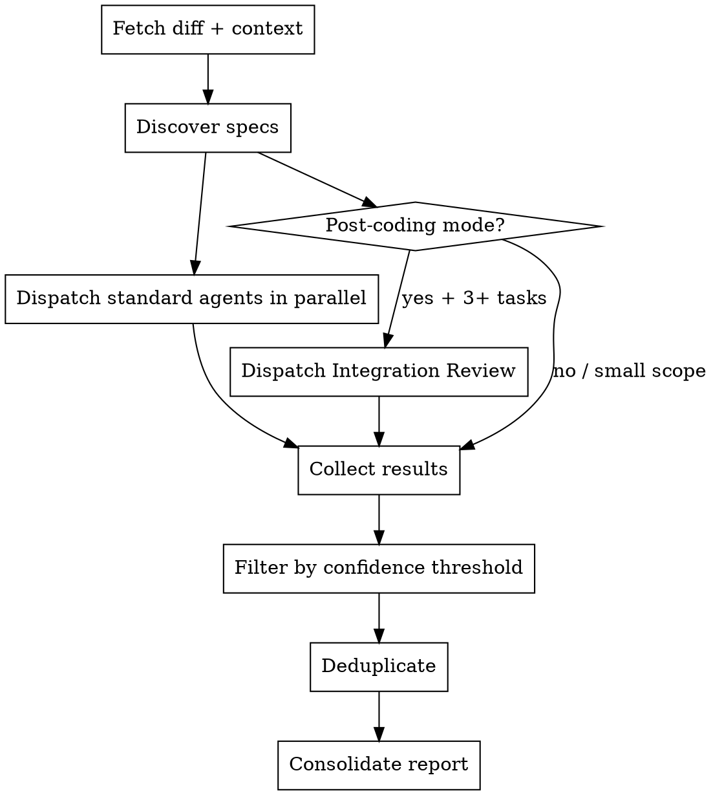
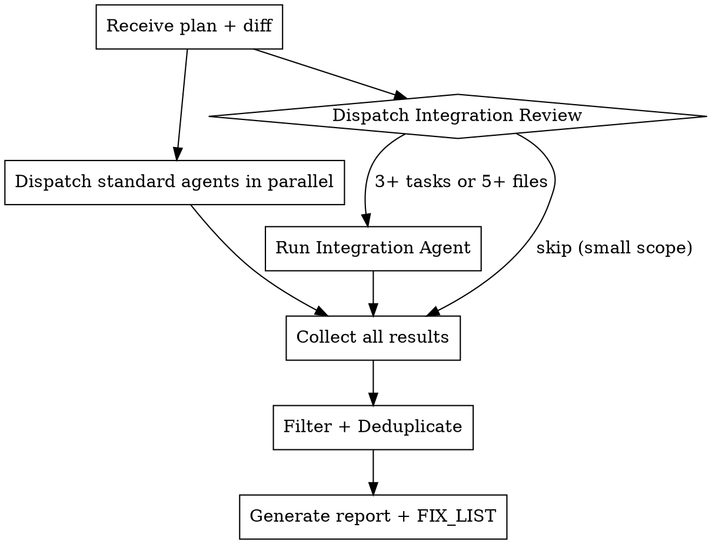

# Multi-Agent Code Review

Review a diff using independent, parallel subagents: one for general code quality, up to three for coding-standard compliance (global, stack, and project level), one for OpenSpec compliance when delta specs are present, and — in post-coding mode with enough scope — one cross-task integration reviewer. Each subagent reviews in isolation; none sees another's output. The confidence score each subagent reports is used to filter out false positives.

**Core principle:** several independent perspectives catch more than one comprehensive reviewer would, and isolation prevents anchoring bias.

## Inputs

Supply one of:
- a pull request URL (what GitLab calls a merge request, or MR — same concept, detected automatically);
- an explicit SHA range (`--base <sha> --head <sha>`);
- nothing, to review the current branch against its upstream merge-base.

For the post-coding mode invoked by `ss-multi-agent-coding`, also supply `--post-coding --plan <plan-file-path>`.

If a URL is given, also fetch its title, description, and commit messages for context.

## Iron Rules

1. **Subagents are independent** — each reviewer works in isolation; never share one subagent's findings with another.
2. **Subagents score their own confidence** — each assigns a 0-100 confidence score to every issue it reports. The orchestrator only filters by threshold; it never re-scores.
3. **Don't trust self-assessment** — "looks good" from a subagent that cited no file:line evidence gets one re-dispatch with an explicit instruction to look again. If the second attempt is still empty, accept it.
4. **No false courtesy** — don't soften or inflate findings; be direct, specific, and actionable.
5. **The orchestrator doesn't review** — you dispatch subagents, filter by threshold, consolidate results, and format the output. You never add your own opinion or judge code quality.
6. **Only flag new issues** — subagents flag issues only on lines modified in this diff. Pre-existing problems on untouched lines are not issues.

## Input Handling

| Input | Detection | Method |
|---|---|---|
| GitLab MR URL | URL path contains `/merge_requests/<number>` | `glab mr diff <number>` + `glab mr view <number>` |
| GitHub PR URL | URL path contains `/pull/<number>` | `gh pr diff <number>` + `gh pr view <number>` |
| Explicit SHA range | `--base <sha> --head <sha>` | `git diff <base>..<head>` |
| Current branch, no args | no arguments given | auto-detect the upstream default branch, compute the merge-base, then `git diff <merge-base>..HEAD` |
| Post-coding mode | `--post-coding --plan <path>` | same diff detection as above, plus reading the plan file for task context; enables Integration Review and the structured `FIX_LIST` output |

Edge cases:
- neither `glab` nor `gh` is available → fall back to `git diff` and ask the user for base/head SHAs;
- the diff is empty (base = head) → report "no changes to review" and stop;
- a subagent dispatch fails or times out → skip it, proceed with the rest, and note the gap in the report.

## Specs Discovery

Before dispatching subagents, discover which specs apply:
1. Read `CLAUDE.md`/`AGENTS.md` at the project root.
2. Categorize the specs in play:
   - **Global specs** — the shared guardrails at `../ss-guardrails/core.md` (security, test standards, review standards, commit-message format).
   - **Stack specs** — the guardrails file matching the project's stack: `../ss-guardrails/java.md`, `go.md`, `cpp.md`, `web.md`, `android.md`, `ios.md`, or `flutter.md`.
   - **Project specs** — project-level rules from `CLAUDE.md`/`AGENTS.md` content, or a project-specific rules directory if the project has one.
3. Dispatch rules:
   - General CR → always dispatched.
   - Global Compliance → always dispatched (`../ss-guardrails/core.md` always applies).
   - Stack Compliance → only if a matching stack guardrails file exists.
   - Project Compliance → only if `CLAUDE.md`/`AGENTS.md` contain project-specific rules, or a project-specific rules directory exists.
   - OpenSpec Compliance → only if the diff includes `openspec/specs/**/spec.md`, `openspec/changes/**/specs/**/spec.md`, or active delta specs exist in the working tree.
   - Integration Review → only in post-coding mode (plan context provided), and only when the change spans 3+ tasks or 5+ files.

## Execution Process



### Step 1: Fetch the Diff & Context

```bash
git diff --name-only <base>..<head>   # changed files
git diff <base>..<head>               # full diff
git log --oneline <base>..<head>      # commit messages
```
Also gather the PR title and description (if a URL was given) and the total lines changed.

### Step 2: Dispatch Subagents in Parallel

Dispatch every applicable subagent at once. Each receives the full diff plus its own review instructions.

For large diffs (>2000 lines): split the General CR subagent's work by file group (~500 lines each) and dispatch several. Compliance subagents get the full diff regardless (rule-matching scales sub-linearly with code volume) unless the diff exceeds 5000 lines, in which case split them by file type too (e.g., source files vs. config files).

### OpenSpec Compliance Agent

Dispatch this reviewer whenever OpenSpec source-of-truth or delta files are present — active deltas, archived deltas, and merged `openspec/specs/<capability>/spec.md` changes created by the `ss-archive` skill.

```
Spawn a subagent:
  description: "OpenSpec compliance review"
  prompt: |
    You are an OpenSpec Compliance Reviewer. Review this diff against the
    repository's OpenSpec living specs and active delta specs.

    ## Diff

    [FULL DIFF]

    ## Active or Archived Delta Specs

    [PASTE openspec/changes/**/specs/*/spec.md relevant to this diff]

    ## Source-of-Truth Specs

    [PASTE relevant openspec/specs/*/spec.md]

    ## What to Check

    - Delta files use exact section headings: ADDED, MODIFIED, REMOVED, RENAMED Requirements.
    - Every Requirement has at least one `#### Scenario:`.
    - MODIFIED Requirements copy the original source-of-truth Requirement in full before showing the change.
    - REMOVED Requirements include both `**Reason:**` and `**Migration:**`.
    - RENAMED uses `FROM: <old> -> TO: <new>`.
    - Archived deltas remain self-contained after archiving.
    - Source-of-truth files reflect the archived delta without dropping unrelated Requirements.
    - Requirement count is proportional to the code change — flag empty or inflated deltas.
    - Code and tests implement every Scenario's WHEN/THEN behavior.
    - Removed behavior has real migration coverage when callers are visible in the diff.

    Only flag issues introduced by this change. Include exact file:line evidence.

    Output each issue with:
    - tag: NEW | PRE-EXISTING
    - severity: CRITICAL | IMPORTANT | MINOR
    - file: exact path:line
    - description
    - reason
    - suggestion
    - confidence: 0-100

    Verdict: APPROVED | NEEDS_CHANGES
```

### Step 3: Collect & Filter

After every subagent returns:
1. **Filter by confidence** — drop every issue scored below 75 by its reporting subagent.
2. **Deduplicate** — if multiple subagents flagged the same issue (same file:line, same problem type — bug/security/naming/pattern), keep the highest-confidence version and note how many subagents independently found it.
3. **Determine the verdict:**
   - any CRITICAL-severity issue (confidence ≥ 90, functionality/security impact) → `CRITICAL_ISSUES`;
   - any IMPORTANT-severity issue (confidence ≥ 75, quality impact) with no CRITICAL → `NEEDS_CHANGES`;
   - only MINOR issues, or none → `APPROVED`.

## Confidence Scoring Guide (for subagents)

| Score | Meaning | Criteria |
|---|---|---|
| 90-100 | Certain | an explicit spec rule is violated and the code clearly violates it, or it's a definite bug with evidence |
| 75-89 | Highly confident | the spec implies this rule and the code likely violates it, or it's very likely a bug given the context |
| 50-74 | Moderately confident | ambiguous — the spec could be read either way, or this might be intentional |
| 25-49 | Somewhat confident | might be real, might be pre-existing or a stylistic preference |
| 0-24 | Not confident | doesn't hold up to scrutiny, likely a false positive |

Every subagent also tags each issue `NEW` (introduced by this change, on a modified line) or `PRE-EXISTING` (already there, on an untouched line). Only `NEW` issues make it into the final report.

## False Positives — Do Not Flag

All subagents must avoid:
- pre-existing issues on lines not modified in this diff;
- issues a linter, typecheck, or CI would already catch (imports, types, formatting);
- intentional functionality changes that are the point of the PR;
- issues already silenced in code (lint-ignore, nolint, `@SuppressWarnings`).

Compliance subagents must also avoid general code-quality opinions not tied to their assigned spec rules, and style preferences not documented in those specs.

The General CR subagent must also avoid nitpicks a senior engineer wouldn't flag, and "while you're at it" suggestions unrelated to the change.

## Subagent Prompt Templates

### General CR Agent

```
Spawn a subagent:
  description: "General code review"
  prompt: |
    You are a Senior Code Reviewer. Review this diff for bugs, architecture
    issues, test quality, and production readiness.

    ## Diff

    [FULL DIFF]

    ## PR Context

    [Title, description, commit messages]

    ## What to Check

    **Bugs & Correctness:**
    - Logic errors, off-by-one, race conditions, null derefs
    - Error handling complete (not just the happy path)
    - Resource leaks, unclosed connections
    - Inputs validated at system boundaries
    - Security: injection, auth bypass, data exposure

    **Functional Completeness:**
    - Does the change achieve what the PR description claims?
    - Are there requirements mentioned but not implemented?
    - Unauthorized scope reduction: stubs or placeholder logic presented as
      finished work, hardcoded/mock data standing in for real behavior,
      "simplified for now" / "will be wired later" comments, or requirements
      quietly deferred to a later phase, MVP, or v2. Flag as CRITICAL unless
      an explicit user decision to cut or defer that scope is recorded in the
      plan file's "User-Confirmed Scope Adjustments" section (post-coding mode)
      or in the PR description (standalone mode).
    - Are there extra features added but not described? (scope creep)
    - If a plan or task list is provided, does every task appear fulfilled?

    **Architecture & Design:**
    - Sound design decisions for the scope
    - No unnecessary coupling or complexity
    - Integrates cleanly with surrounding code
    - Each file has one clear responsibility
    - Complexity proportional to the problem (no over-engineering)

    **Test Quality:**
    - New behavior has corresponding tests
    - Tests verify behavior, not implementation details
    - Tests are independent (no shared state, no order dependency)
    - Edge cases covered for critical paths
    - No test hacks (modifying tests to pass instead of fixing code)

    **Production Readiness:**
    - Backward compatibility considered
    - Performance: no N+1 queries, no unbounded operations
    - No sensitive data logged or exposed
    - No dead code, commented-out code, or debug artifacts

    ## Critical Rules

    Only flag issues on lines modified in this diff.
    Tag each issue NEW (on a modified line) or PRE-EXISTING (on an untouched line).

    Do NOT flag:
    - Pre-existing issues on unmodified lines
    - Issues a linter/typecheck/CI would catch
    - Nitpicks a senior engineer wouldn't mention
    - Intentional behavior changes that are the point of the PR

    ## Output Format

    For each issue:
    - tag: NEW | PRE-EXISTING
    - severity: CRITICAL | IMPORTANT | MINOR
    - file: exact path:line
    - description: what's wrong
    - reason: why it matters
    - suggestion: how to fix it
    - confidence: 0-100

    Strengths: 1-3 specific things done well (with file:line).
    Verdict: APPROVED | NEEDS_CHANGES
```

### Global Compliance Agent

```
Spawn a subagent:
  description: "Global spec compliance review"
  prompt: |
    You are a Global Spec Compliance Reviewer. Check this diff against the
    GLOBAL guardrails: security, unit-test standards, review standards, and
    commit-message format.

    ## Diff

    [FULL DIFF]

    ## Global Guardrails

    [PASTE the full content of ../ss-guardrails/core.md]

    ## Your Scope

    Only check against the guardrails provided above. Focus areas:
    - Security rules (input validation, auth, data protection, injection)
    - Unit test standards (coverage, structure, naming, patterns)
    - Commit-message format (conventional commits, message length, type)
    - Review standards, if defined

    ## Critical Rules

    Only flag violations on lines modified in this diff.
    Tag each issue NEW or PRE-EXISTING.
    Only flag violations of rules explicitly stated in the provided guardrails.
    Don't add opinions beyond what the guardrails document.

    ## Output Format

    For each violation:
    - tag: NEW | PRE-EXISTING
    - spec_rule: "[guardrails file] section X, rule Y" (exact reference)
    - file: exact path:line
    - violation: what the code does
    - expected: what the guardrails require
    - confidence: 0-100
    - severity: CRITICAL | IMPORTANT | MINOR

    Verdict: COMPLIANT | HAS_VIOLATIONS | NOT_APPLICABLE
```

### Stack Compliance Agent

```
Spawn a subagent:
  description: "Stack spec compliance review"
  prompt: |
    You are a Stack Spec Compliance Reviewer. Check this diff against the
    TECHNOLOGY STACK guardrails: naming conventions, API patterns, error
    handling, logging, and language-specific rules.

    ## Diff

    [FULL DIFF]

    ## Stack Guardrails

    [PASTE the full content of the guardrails file matching this repo's stack —
     ../ss-guardrails/java.md, go.md, cpp.md, web.md, android.md, ios.md, or flutter.md]

    ## Your Scope

    Only check against the guardrails provided above. Focus areas:
    - Naming conventions (classes, methods, variables, constants)
    - API design patterns (request/response structure, error codes)
    - Error/exception handling patterns
    - Logging patterns and levels
    - Language-specific idioms defined in the guardrails

    ## Critical Rules

    Only flag violations on lines modified in this diff.
    Tag each issue NEW or PRE-EXISTING.
    Only flag violations of rules explicitly stated in the provided guardrails.
    Don't flag style preferences the guardrails don't cover.

    ## Output Format

    For each violation:
    - tag: NEW | PRE-EXISTING
    - spec_rule: "[guardrails file] section X, rule Y" (exact reference)
    - file: exact path:line
    - violation: what the code does
    - expected: what the guardrails require
    - confidence: 0-100
    - severity: CRITICAL | IMPORTANT | MINOR

    Verdict: COMPLIANT | HAS_VIOLATIONS | NOT_APPLICABLE
```

### Project Compliance Agent

```
Spawn a subagent:
  description: "Project spec compliance review"
  prompt: |
    You are a Project Spec Compliance Reviewer. Check this diff against
    PROJECT-LEVEL rules defined in CLAUDE.md, AGENTS.md, or project-specific
    rule files.

    ## Diff

    [FULL DIFF]

    ## Project Rules

    [PASTE the project-specific content of CLAUDE.md/AGENTS.md, or the
     project's own rules directory]

    ## Your Scope

    Only check against the project rules provided above. These may include:
    - Project-specific conventions (file organization, module boundaries)
    - Architecture rules (dependency direction, layer isolation)
    - Project-specific naming or configuration rules
    - Workflow rules (branch naming, PR format)

    ## Critical Rules

    Only flag violations on lines modified in this diff.
    Tag each issue NEW or PRE-EXISTING.
    Only flag violations of rules explicitly stated in the provided project docs.
    Don't add opinions beyond what the project docs state.

    ## Output Format

    For each violation:
    - tag: NEW | PRE-EXISTING
    - spec_rule: "[source file] rule description" (exact reference)
    - file: exact path:line
    - violation: what the code does
    - expected: what the rule requires
    - confidence: 0-100
    - severity: CRITICAL | IMPORTANT | MINOR

    Verdict: COMPLIANT | HAS_VIOLATIONS | NOT_APPLICABLE
```

### Integration Review Agent (post-coding mode only)

Only dispatched when this skill is invoked with plan context (see "Post-Coding Mode" below). It verifies that a multi-task implementation integrates correctly as a whole.

```
Spawn a subagent:
  description: "Integration review for multi-task implementation"
  model: your most capable model
  prompt: |
    You are performing an integration review after multiple implementation
    tasks have been completed. Individual code quality and spec compliance
    have already been checked by other reviewers. Your job is different:
    verify the WHOLE is coherent, not re-review the parts.

    ## Plan Summary

    **Goal:** [from plan header]
    **Architecture:** [from plan header]
    **Total tasks completed:** N
    **Task-to-file mapping:** [which task changed which files]

    ## Diff

    [FULL DIFF — all changes across all tasks]

    ## What to Check

    **1. Cross-task integration**
    - Do the pieces connect correctly?
    - Are interfaces between tasks compatible (types match, contracts honored)?
    - Does data flow correctly across module boundaries?
    - Are there assumption mismatches between tasks?

    **2. Orphan code**
    - Unused imports across the changeset?
    - Dead functions that nothing calls?
    - Stale references to removed/renamed code?

    **3. Naming consistency**
    - Same concept uses the same name across all new files?
    - No inconsistent abbreviations (e.g., "payment" in one file, "pmt" in another)?

    **4. Architecture alignment**
    - Does the implementation match the plan's stated architecture?
    - Any unexpected deviations from the design?
    - Correct dependency direction (no circular dependencies)?

    **5. Completeness**
    - Does the plan's goal appear achieved by the combined changes?
    - Any integration gaps (e.g., service A exposes an endpoint but service B never calls it)?

    ## Critical Rules

    Do NOT re-review what other agents already checked (code quality, spec
    compliance, individual correctness). Focus only on integration.
    Only flag issues on lines modified in this diff.
    Tag each issue NEW or PRE-EXISTING.

    ## Output Format

    For each issue:
    - tag: NEW | PRE-EXISTING
    - severity: CRITICAL | IMPORTANT | MINOR
    - type: INTEGRATION | ORPHAN | INCONSISTENCY | GAP
    - files: which tasks/files are involved
    - description: what's wrong
    - suggestion: how to fix it, and which task's implementer should handle it
    - confidence: 0-100

    Verdict: APPROVED | NEEDS_CHANGES
```

Dispatch rules: required when plan context is provided (post-coding mode) and the change spans 3+ tasks or 5+ files; skipped for standalone review, or when the change is 2 tasks/4 files or smaller. Always use your most capable model — it needs broad context understanding.

## Output Format

Generate a consolidated report:

```markdown
# Code Review Report

**Summary:** [1-2 sentences describing the purpose and scope of this change]
**Scope reviewed:** N files, M lines changed
**Verdict:** APPROVED | NEEDS_CHANGES | CRITICAL_ISSUES

---

## Issues Found

### Critical (must fix)
1. **[Short description]** (confidence: N/100)
   - File: `path/to/file.ext:line`
   - Issue: [what's wrong]
   - Reason: [why it matters]
   - Suggestion: [how to fix it]
   - Source: [General CR / Global Spec / Stack Spec / Project Spec / Integration Review]
   - Independently found by: [how many agents independently flagged this]

### Important (should fix)
...

### Minor (nice to have)
...

---

## Strengths
- [1-3 specific things done well, with file:line]

## Review Statistics
- General CR: N issues reported, M after filtering
- Global Compliance: N issues reported, M after filtering
- Stack Compliance: N issues reported, M after filtering
- Project Compliance: N issues reported, M after filtering (or "not run")
- Integration Review: N issues reported, M after filtering (or "not run — no plan context")
- Confidence filtering: X issues removed (confidence < 75)
- Deduplication: Y duplicate issues merged
- **Final issue count: Z**

## Verdict Rationale
- [why this is APPROVED / NEEDS_CHANGES / CRITICAL_ISSUES]
```

Write the report in the same language as the project's existing docs; default to English when there's no clear signal.

## Post-Coding Mode

When `ss-multi-agent-coding` invokes this skill (rather than a standalone review), it runs in **post-coding mode** with richer context and an extra Integration Review agent.

### How to Detect Post-Coding Mode

Activated only by the explicit flag: `--post-coding --plan <path>`. If that flag isn't passed, this skill runs in standalone mode even if a plan file happens to exist in the workspace. `ss-multi-agent-coding` always passes this flag explicitly.

### Additional Inputs in Post-Coding Mode

| Input | Source | Used by |
|---|---|---|
| Plan file (goal, architecture, task list) | path passed by `ss-multi-agent-coding` | Integration Review Agent, General CR |
| Task-to-file mapping | list provided by `ss-multi-agent-coding` | Integration Review Agent, feedback routing |
| `TEST_COMMAND` result | pass/fail reported by `ss-multi-agent-coding` | included in report context |

### What Changes in Post-Coding Mode

| Aspect | Standalone mode | Post-coding mode |
|---|---|---|
| Integration Review Agent | not dispatched | dispatched if 3+ tasks or 5+ files |
| General CR — functional completeness | checks against the PR description only | also checks against plan tasks |
| Feedback format | human-readable report only | also returns a structured `FIX_LIST` |
| Verdict escalation | reported to the user | reported to the `ss-multi-agent-coding` orchestrator for its fix loop |

### Structured Feedback (post-coding mode only)

When the verdict is `NEEDS_CHANGES` or `CRITICAL_ISSUES`, append a machine-readable `FIX_LIST`:

```markdown
## FIX_LIST

- fix_id: 1
  severity: CRITICAL
  source_agent: General CR
  files: [src/service/PaymentService.java:42]
  description: Missing null check on callback.orderId
  task_ids: [1]
  task_hint: PaymentService changes

- fix_id: 2
  severity: IMPORTANT
  source_agent: Integration Review
  files: [src/service/PaymentService.java, src/controller/PaymentController.java]
  description: PaymentService returns PaymentResult but the controller expects PaymentResponse — type mismatch
  task_ids: [1, 3]
  task_hint: interface mismatch between PaymentService and PaymentController
```

Field definitions: `fix_id` (sequential integer), `severity` (`CRITICAL` | `IMPORTANT`), `source_agent` (which reviewer found it), `files` (always a list, even for one file), `description`, `task_ids` (list, machine-parseable), `task_hint` (optional human-readable routing context).

`ss-multi-agent-coding` uses `FIX_LIST` to route each fix to the right implementer by `task_hint`, re-dispatch only the affected implementers, and re-invoke this skill in post-coding mode for verification (max 2 review cycles).

### Post-Coding Mode Execution Flow



## Anti-Patterns

| Anti-pattern | Why it's harmful | Correct approach |
|---|---|---|
| Sharing findings between subagents | anchoring bias, loses independence | total isolation until consolidation |
| Orchestrator re-scoring confidence | violates "the orchestrator doesn't review" | subagents score, the orchestrator only filters at the threshold |
| Including pre-existing issues | the user can't fix what they didn't change | only flag issues on modified lines (NEW tag) |
| Flagging linter-catchable issues | wastes attention, CI already handles this | explicitly exclude these |
| General opinions without file:line | not actionable | every issue needs an exact location |
| Orchestrator adding its own opinions | breaks independence, adds bias | only consolidate, never add |
| A single subagent doing all the review | one perspective misses blind spots | multiple independent subagents (exception: no specs found → General CR alone is fine) |
| No confidence scoring | report full of false positives | every issue needs a 0-100 score |
| Infinite re-dispatch loop | wastes resources when a subagent truly finds nothing | max one re-dispatch per subagent |

## Red Flags — Stop

- About to share Subagent A's findings with Subagent B → stop, independence violated.
- A subagent returned "looks good" with no file:line evidence → re-dispatch once with an explicit "read the code" instruction; if still empty after the second attempt, accept it.
- About to include an issue with confidence below 75 → stop, filter it out.
- About to include a `PRE-EXISTING`-tagged issue → stop, discard it.
- About to add your own review opinion to the report → stop, you're the orchestrator, not a reviewer.

## Edge Cases

- No specs found for any tier → run only the General CR agent, and note that in the report.
- Diff is very large (>2000 lines) → split General CR by file group (~500 lines); compliance agents still get the full diff unless it's over 5000 lines.
- PR is a draft (GitLab: MR) → review normally, note "draft PR" in the report header.
- No issues found after filtering → report "APPROVED — no issues above the confidence threshold."
- Subagent dispatch fails or times out → skip it, note it in the report, proceed with the rest.
- Diff is empty → report "no changes to review" and stop.
- Post-coding mode with small scope → if 2 tasks/4 files or fewer, skip Integration Review (too small to benefit).
- Post-coding mode with `NEEDS_CHANGES` → return structured feedback with task-to-fix mapping so `ss-multi-agent-coding` can re-dispatch targeted implementers.

## Examples

- Standalone, current branch: `ss-multi-agent-cr`
- Standalone, GitLab MR: `ss-multi-agent-cr --mr https://gitlab.example.com/backend/order-service/-/merge_requests/456`
- Standalone, explicit SHA range: `ss-multi-agent-cr --base abc123 --head def456`
- Post-coding (invoked by `ss-multi-agent-coding`, includes Integration Review + FIX_LIST): `ss-multi-agent-cr --post-coding --plan docs/plans/2026-05-10-user-payment.md`
